# UCE Génie Logiciel Avancé - Techniques de Tests


## BADGES

Olivier FABRE  
upav 2104042  
Master 1 ILSEN Classic 1 Group 1      

**CircleCI - Intégration Continue**

[](https://dl.circleci.com/status-badge/redirect/circleci/7MzTkwBFxHK2MkeUAifbjS/2LAHbRt645vW3tJZXN6rXF/tree/master)

**CodeCov - Couverture de Test**  

[](https://codecov.io/github/olfabre/ceri-m1-techniques-de-test)

**Check style - **   
   
[)](https://olfabre.github.io/ceri-m1-techniques-de-test/fr/univavignon/pokedex/api/package-summary.html)

---

## Mes sources 

ces sources pour réaliser les différents TPs

- jmdoudoux.fr: https://www.jmdoudoux.fr/java/dej/chap-junit.htm#junit

- Manuel du dev de ENSI de Caen: https://foad.ensicaen.fr/pluginfile.php/1214/course/section/635/Mockito.pdf


## Mes explications pour les TPs 1-2-3

#### 1.Le contexte

je programme en java avec la configuration suivante:

```bash
java --version

openjdk 21.0.1 2023-10-17
OpenJDK Runtime Environment (build 21.0.1+12-29)
OpenJDK 64-Bit Server VM (build 21.0.1+12-29, mixed mode, sharing)
```

J'utilise un IDE IntelliJ IDEA

```bash
IntelliJ IDEA 2024.2.3 (Ultimate Edition)
Build #IU-242.23339.11, built on September 25, 2024
Licensed to Olivier Fabre
Subscription is active until April 28, 2025.
For educational use only.
Runtime version: 21.0.4+13-b509.17 x86_64 (JCEF 122.1.9)
VM: OpenJDK 64-Bit Server VM by JetBrains s.r.o.
Toolkit: sun.lwawt.macosx.LWCToolkit
macOS 10.15.7
GC: G1 Young Generation, G1 Concurrent GC, G1 Old Generation
Memory: 2048M
Cores: 8
Metal Rendering is ON
Registry:
  ide.experimental.ui=true
  i18n.locale=
Non-Bundled Plugins:
  com.jetbrains.space (242.23339.11)
  monokai-pro (1.10)
  com.markskelton.one-dark-theme (5.12.0)
  com.jetbrains.packagesearch.intellij-plugin (242.0.12)
Kotlin: 242.23339.11-IJ
```

Je travaille avec Maven qui est un outil de gestion et d'automatisation de projets pour le langage Java:

- Il permet la gestion des dépendances grâvce au fichier pom.xml
- Il impose une structure de projet standard.
- Il définit un cycle de vie de construction avec les phases prédéfinies (compile, test, package, install et deploy). Cela vous permet de gérer facilement le processus de développement et de déploiement d'une application.
- Maven est extensible grâce à des plugins, qui ajoutent des fonctionnalités pour des tâches spécifiques comme la compilation, le test, l'exécution de code statique, et le déploiement.
- Maven s'intègre facilement avec des IDE comme IntelliJ IDEA, Eclipse, et des outils d'intégration continue comme Jenkins, CircleCI, etc.
- Il fournit des fonctionnalités pour générer de la documentation pour un projet, ce qui peut être utile pour maintenir et partager des informations avec d'autres développeurs.

Pour les tests automatiques (intégration continue), j'utilise une application tiers en partie gratuite:

https://app.circleci.com/

qui permets avec son compte GitHub, de créer un pipeline et de réaliser des tests automatique à chaque commit.

Quel est l'intérêt de passer par une application tierce ?

Mon code fonctionne sur ma machine mais qui me dit que ce dernier fonctionne aussi sur d'autres machines? La vérification par un tiers sur un environnement isolé permet de s'assurer avec une forte probabilité que le code fonctionnera ailleurs.

#### Maven et Pom.xml

Pour maven, à la racine j'ai créé le fichier pom.xml pour sa configuration:


```xml
<project xmlns="http://maven.apache.org/POM/4.0.0"
         xmlns:xsi="http://www.w3.org/2001/XMLSchema-instance"
         xsi:schemaLocation="http://maven.apache.org/POM/4.0.0 http://maven.apache.org/xsd/maven-4.0.0.xsd">
    <modelVersion>4.0.0</modelVersion>

    <groupId>fr.univavignon</groupId>
    <artifactId>ceri-m1-techniques-de-test</artifactId>
    <version>1.0-SNAPSHOT</version>
    <name>CERI M1 Techniques de Test</name>
    <description>Projet pour l'apprentissage des techniques de test d'API.</description>

    <properties>
        <maven.compiler.source>1.8</maven.compiler.source>
        <maven.compiler.target>1.8</maven.compiler.target>
        <project.build.sourceEncoding>UTF-8</project.build.sourceEncoding> <!-- Encodage par défaut -->
    </properties>

    <dependencies>
        <!-- Dépendance pour JUnit -->
        <dependency>
            <groupId>junit</groupId>
            <artifactId>junit</artifactId>
            <version>4.13.2</version>
            <scope>test</scope>
        </dependency>

        <!-- Dépendance pour Mockito -->
        <dependency>
            <groupId>org.mockito</groupId>
            <artifactId>mockito-core</artifactId>
            <version>3.12.4</version>
            <scope>test</scope>
        </dependency>
    </dependencies>

    <build>
        <plugins>
            <plugin>
                <groupId>org.apache.maven.plugins</groupId>
                <artifactId>maven-compiler-plugin</artifactId>
                <version>3.8.1</version>
                <configuration>
                    <source>1.8</source>
                    <target>1.8</target>
                </configuration>
            </plugin>
        </plugins>
    </build>
</project>
```


##### > En-tête du fichier et déclaration du projet

```xml
<project xmlns="http://maven.apache.org/POM/4.0.0"
         xmlns:xsi="http://www.w3.org/2001/XMLSchema-instance"
         xsi:schemaLocation="http://maven.apache.org/POM/4.0.0 http://maven.apache.org/xsd/maven-4.0.0.xsd">
```

Cette partie définit le projet Maven et spécifie la version du POM (Project Object Model) à utiliser (`4.0.0`), qui est une spécification de la structure des projets Maven. Les autres attributs XML (comme `xmlns:xsi`) définissent l'espace de noms XML et où se trouve le schéma XML correspondant.

##### > Version du modèle

```xml
<modelVersion>4.0.0</modelVersion>
```

Indique la version du modèle POM. La version `4.0.0` est la version standard utilisée dans Maven.

##### > GroupId, ArtifactId, et Version


```xml
<groupId>fr.univavignon</groupId>
<artifactId>ceri-m1-techniques-de-test</artifactId>
<version>1.0-SNAPSHOT</version>
```

**groupId** : Identifie de manière unique le projet au sein d'une organisation (ici, `fr.univavignon`).

**artifactId** : Nom du projet ou module. Il doit être unique au sein du groupId (ici, `ceri-m1-techniques-de-test`).

**version** : La version du projet. `1.0-SNAPSHOT` indique qu'il s'agit d'une version en développement, non stable. Une version stable serait simplement marquée `1.0`.

##### > Nom et description du projet

```xml
<name>CERI M1 Techniques de Test</name>
<description>Projet pour l'apprentissage des techniques de test d'API.</description>
```

**name** : Nom lisible du projet.

**description** : Brève description du projet.

##### > Propriétés

```xml
<properties>
    <maven.compiler.source>1.8</maven.compiler.source>
    <maven.compiler.target>1.8</maven.compiler.target>
    <project.build.sourceEncoding>UTF-8</project.build.sourceEncoding>
</properties>
```

**maven.compiler.source** et **maven.compiler.target** : Spécifient la version de Java à utiliser pour la compilation du projet (Java 1.8).

**project.build.sourceEncoding** : Définit l'encodage des fichiers sources, ici UTF-8.

##### > Dépendances

```xml
<dependencies>
    <!-- Dépendance pour JUnit -->
    <dependency>
        <groupId>junit</groupId>
        <artifactId>junit</artifactId>
        <version>4.13.2</version>
        <scope>test</scope>
    </dependency>

    <!-- Dépendance pour Mockito -->
    <dependency>
        <groupId>org.mockito</groupId>
        <artifactId>mockito-core</artifactId>
        <version>3.12.4</version>
        <scope>test</scope>
    </dependency>
</dependencies>
```

Les dépendances sont des bibliothèques dont le projet a besoin pour fonctionner. Ici, deux dépendances sont déclarées :

- **JUnit** : Un framework pour les tests unitaires (version 4.13.2), utilisé uniquement dans le cadre des tests (scope `test`). Les classes de Junit 4 sont dans le package org.junit
- **Mockito** : Une bibliothèque pour créer des mocks dans les tests (version 3.12.4), également utilisée dans les tests uniquement. Cela signifie que **Mockito** sera utilisé uniquement lors des phases de test (`scope` = `test`). Cela te permet de **simuler** les composants que tu ne souhaites pas tester directement (comme des services externes ou des bases de données) pour te concentrer sur le comportement de la classe que tu testes.


##### > Build et plugins

```xml
<build>
    <plugins>
        <plugin>
            <groupId>org.apache.maven.plugins</groupId>
            <artifactId>maven-compiler-plugin</artifactId>
            <version>3.8.1</version>
            <configuration>
                <source>1.8</source>
                <target>1.8</target>
            </configuration>
        </plugin>
    </plugins>
</build>
```

**build** : Déclare les instructions de compilation spécifiques au projet.

**plugin maven-compiler-plugin** : Le plugin Maven utilisé pour compiler le code Java. La configuration précise qu'il utilise Java 1.8 (source et target).

Cependant, tu mentionnes que tu as le **JDK 21** installé, ce qui est bien plus récent. Cela ne pose pas nécessairement problème, mais il faut comprendre que :

- **Java 1.8** (Java 8) est une version plus ancienne de Java, mais beaucoup de projets utilisent encore cette version pour des raisons de compatibilité.
- **JDK 21** est la version la plus récente, mais tu peux toujours compiler du code en **Java 1.8** même avec un JDK plus récent, tant que le projet est configuré pour cibler cette version.

Maven peut être utilisé avec ses principales fonctions directement par l'IDE IntelliJ comme on peut le voir sur l'image ci-dessous

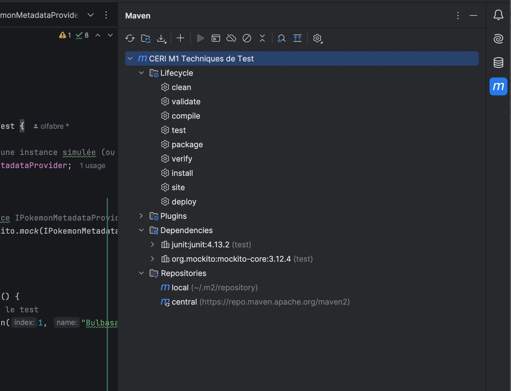

##### Mockito

**Mockito** est une bibliothèque Java utilisée principalement pour les tests unitaires. Elle permet de **créer des objets simulés**, appelés *mocks*, afin de tester l'interaction entre différentes parties de ton code sans avoir à dépendre de leurs implémentations réelles. Cela est particulièrement utile lorsque certaines parties de ton code interagissent avec des composants externes comme des bases de données, des API, ou d'autres services dont tu ne veux pas charger l'implémentation complète durant un test.

##### Version de Mockito : 3.12.4

- **Date de sortie** : Cette version est sortie en 2021.
- **Améliorations** : À partir de la version 3.x, Mockito a introduit plusieurs fonctionnalités et corrections pour améliorer la gestion des mocks, les performances, et la compatibilité avec les versions modernes de Java. Elle est plus stable et plus performante que les versions précédentes (comme la 1.x et 2.x).


##### Rôle principal de Mockito :

1. **Mocking** : Tu peux créer des objets factices (mocks) qui imitent le comportement des vraies instances. Cela te permet de **tester l'intégration de différentes parties de ton application** sans les implémentations réelles. Par exemple, si tu veux tester une méthode qui fait un appel à une API externe, tu n'as pas besoin de réellement appeler cette API ; tu peux simuler la réponse avec un mock.
2. **Spécifier des comportements** : Tu peux définir comment le mock doit se comporter lorsqu'une méthode spécifique est appelée. Cela permet de **contrôler les réponses** lors du test. Par exemple :

```java
when(mockedObject.someMethod()).thenReturn(someValue);
```

3. **Vérification des interactions** : Mockito te permet aussi de **vérifier** si une méthode d'un objet a été appelée, combien de fois elle a été appelée, et avec quels arguments. Par exemple :

```java
verify(mockedObject, times(1)).someMethod();
```

4. **Tests sans effets de bord** : En utilisant Mockito, tu peux tester des classes sans créer de dépendances réelles, ce qui rend tes tests plus rapides, isolés, et faciles à exécuter dans n'importe quel environnement.

#### Arborescence d'un projet java

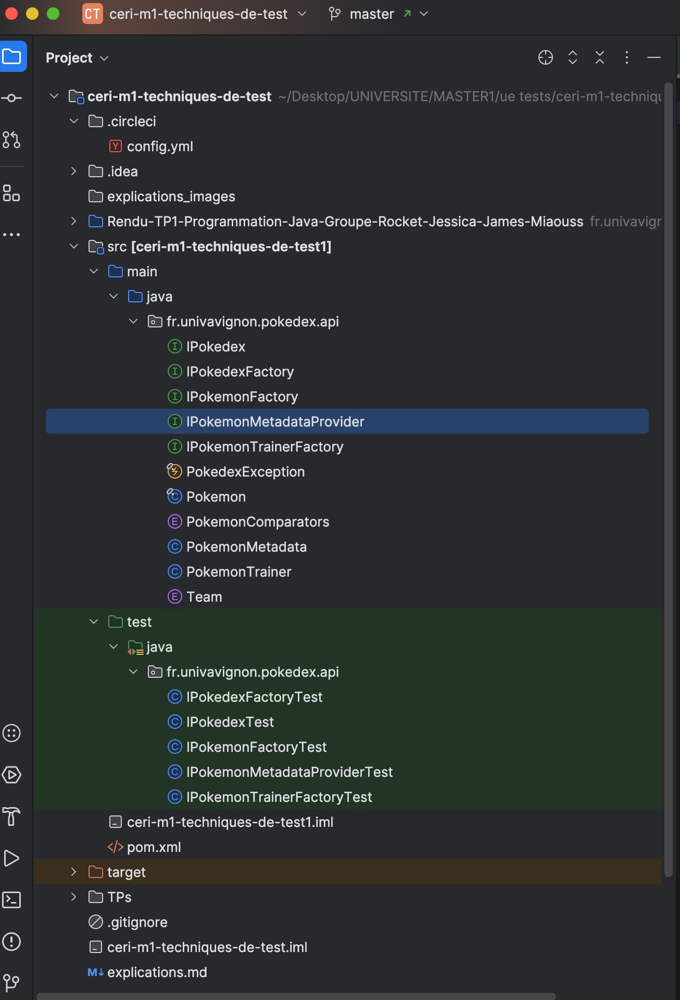


### 2. Comment tester son code

Mockito est un générateur automatique de doublures qui peut être utilisé en conjonction avec JUnit. Il permet de créer des objets doublures à partir de n'importe quelle classe ou d'interface. Les doublures sont totalement contrôlables. Il suffit d’en déterminer le comportement en imposant les valeurs de retour aux méthodes : le "stubbing". 

**ATTENTION**: Mockito ne peut pas doubler les classes déclarées final.


#### La définition d'une classe test

Nous souhaitons réaliser un fichier test de l'interface `IPokemonMetadataProvider`et plsu exactement de sa méthode `getPokemonMetadata(int index)`

```java
package fr.univavignon.pokedex.api;

/**
 * Un IPokemonMetadataProvider a pour but de fournir des PokemonMetadata pour un index de pokémon donné.
 * @author fv
 */
public interface IPokemonMetadataProvider {

	/**
	 * Récupère et renvoie les métadonnées du pokémon.
	 * dénoté par le <tt>index</tt> donné.
	 * 
	 * @param index Index du pokémon pour lequel des métadonnées doivent être récupérées.
	 * @return Métadonnées du pokémon.
	 * @throws PokedexException Si le <tt>index</tt> donné n'est pas valide.
	 */
	PokemonMetadata getPokemonMetadata(int index) throws PokedexException;
	
}
```

On créé un fichier class java dans l'arborescence `test/java/fr.univavignon.pokedex.api`

Pour créer cette arborescence, on créé d'abord le dossier `test`

ensuite on créé le dossier `java` et un package `fr.univavignon.pokedex.api`

On marque `test`comme **Test Source Root**

```java
package fr.univavignon.pokedex.api;

import org.junit.*;
import static org.junit.Assert.*;
import org.mockito.Mockito;

public class IPokemonMetadataProviderTest {
}
```


#### Classe test

```java
package fr.univavignon.pokedex.api;

    import org.junit.*;
    import static org.junit.Assert.*;
    import org.mockito.Mockito;


    public class IPokemonMetadataProviderTest {

        private IPokemonMetadataProvider pokemonMetadataProvider;

        @Before
        public void initialisation() {
            // Crée le mock sans utiliser d'import statique
            pokemonMetadataProvider = Mockito.mock(IPokemonMetadataProvider.class);
        }

        @Test
        public void testGetPokemonMetadata() throws Exception {
            // Crée un objet fictif pour le test
            PokemonMetadata bulbasaur = new PokemonMetadata(1, "Bulbasaur", 126, 126, 90);

            // Définir le comportement du mock
            Mockito.when(pokemonMetadataProvider.getPokemonMetadata(1)).thenReturn(bulbasaur);

            // Appeler la méthode testée
            PokemonMetadata result = pokemonMetadataProvider.getPokemonMetadata(1);

            // Vérifier les résultats avec des assertions
            assertEquals("Bulbasaur", result.getName());
            assertEquals(126, result.getAttack());
            assertEquals(126, result.getDefense());
            assertEquals(90, result.getStamina());

            // Vérifier que la méthode a été appelée une fois avec l'argument 1
            Mockito.verify(pokemonMetadataProvider).getPokemonMetadata(1);
        }
    }
```

### 3. Explication

#### Déclaration de la classe de test

```java
public class IPokemonMetadataProviderTest {
```

Cette classe teste l'interface `IPokemonMetadataProvider`


#### Variable de test

```java
private IPokemonMetadataProvider pokemonMetadataProvider;
```

On déclare une variable `pokemonMetadataProvider`, qui représente l'objet à tester. Il s'agit d'un mock de l'interface `IPokemonMetadataProvider`.


#### Méthode `@Before`

```java
@Before
public void initialisation() {
    // Crée le mock sans utiliser d'import statique
    pokemonMetadataProvider = Mockito.mock(IPokemonMetadataProvider.class);
}
```

**@Before** : Cette annotation indique que cette méthode sera exécutée avant chaque test. Ici, elle sert à initialiser le mock de `IPokemonMetadataProvider`.

**Mockito.mock(...)** : Crée un mock, c'est-à-dire un objet factice de l'interface, que tu peux manipuler en définissant son comportement pour le test.


#### Méthode de test

```java
@Test
public void testGetPokemonMetadata() throws Exception {
```

**@Test** : Indique que cette méthode est un test. Le framework JUnit exécutera cette méthode pour vérifier si la fonctionnalité marche correctement.

**throws Exception** : Permet de gérer des exceptions, comme celles qui pourraient être lancées par la méthode `getPokemonMetadata`.


#### Création d'un objet de test

```java
PokemonMetadata bulbasaur = new PokemonMetadata(1, "Bulbasaur", 126, 126, 90);
```

On crée un objet `PokemonMetadata` avec des valeurs fictives. Cet objet représente les métadonnées d'un Pokémon (Bulbizarre ici), avec son index, nom, attaque et stamina.


#### Définir le comportement du mock

```java
Mockito.when(pokemonMetadataProvider.getPokemonMetadata(1)).thenReturn(bulbasaur);
```

**Mockito.when(...)** : On utilise cette méthode pour définir le comportement attendu du mock. Ici, on lui dit que lorsque la méthode `getPokemonMetadata` est appelée avec l'index `1`, elle doit retourner l'objet `bulbasaur`.

**thenReturn(bulbasaur)** : Indique que lorsque l'index 1 est demandé, il doit retourner les données de `bulbasaur`.

### 

#### Appel de la méthode testée

```java
PokemonMetadata result = pokemonMetadataProvider.getPokemonMetadata(1);
```

On appelle la méthode `getPokemonMetadata` avec l'index `1` et stocke le résultat dans la variable `result`.


#### Vérification des résultats avec des assertions

```java
// Vérifier les résultats avec des assertions
            assertEquals("Bulbasaur", result.getName());
            assertEquals(126, result.getAttack());
            assertEquals(126, result.getDefense());
            assertEquals(90, result.getStamina());
```

assertEquals(...)

Ces assertions vérifient si le résultat obtenu est conforme à ce qui est attendu.

- On vérifie que le nom du Pokémon est bien "Bulbasaur".
- Que son attaque est bien 126.
- Que sa défense est bien 126.
- Que son stamina est 90.

Si une des valeurs ne correspond pas, le test échoue.


#### Vérification de l'appel de la méthode

```java
Mockito.verify(pokemonMetadataProvider).getPokemonMetadata(1);
```

**Mockito.verify(...)** : Cette ligne vérifie que la méthode `getPokemonMetadata(1)` a bien été appelée exactement une fois avec l'argument 1. Si ce n'est pas le cas, le test échoue.


### 4. Version 2

```java
    package fr.univavignon.pokedex.api;

    import org.junit.*;
    import static org.junit.Assert.*;
    import org.mockito.Mockito;


    public class IPokemonMetadataProviderTest {

        private IPokemonMetadataProvider pokemonMetadataProvider;
        private PokemonMetadata bulbasaur;

        @Before
        public void initialisation() {
            // Crée le mock sans utiliser d'import statique
            pokemonMetadataProvider = Mockito.mock(IPokemonMetadataProvider.class);
            // Crée un objet fictif pour le test
             bulbasaur = new PokemonMetadata(1, "Bulbasaur", 126, 126, 90);
        }

        @Test
        public void testGetPokemonMetadata() throws Exception {


            // Définir le comportement du mock
            Mockito.when(pokemonMetadataProvider.getPokemonMetadata(1)).thenReturn(bulbasaur);

            // Appeler la méthode testée
            PokemonMetadata result = pokemonMetadataProvider.getPokemonMetadata(1);

            // Vérifier les résultats avec des assertions
            assertEquals("Bulbasaur", result.getName());
            assertEquals(126, result.getAttack());
            assertEquals(126, result.getDefense());
            assertEquals(90, result.getStamina());

            // Vérifier que la méthode a été appelée une fois avec l'argument 1
            Mockito.verify(pokemonMetadataProvider).getPokemonMetadata(1);
        }

            @After
            public void nettoyer() throws Exception {
                bulbasaur = null;
            }
    }
```

**@After** : La méthode `nettoyer()` est exécutée après chaque test. Ici, elle est utilisée pour réinitialiser `bulbasaur` en le mettant à `null`, ce qui permet de garantir que chaque test commence avec un environnement propre.


**Attention**: 

il faut bien définir l'objectif. On souhaite tester la méthode définie dans l'interface `PokemonMetadata getPokemonMetadata(int index)`. Cette méthode prend un seul argument et retourne un objet de type `PokemonMetadata` . Si on va dans la classe `PokemonMetadata` on peut s'appercevoir que le constructeur est le suivant `public PokemonMetadata(final int index, final String name, final int attack, final int defense, final int stamina)`

Cela signifie que pour tester la méthode `getPokemonMetadata(int index)` nous devons créer un objet `PokemonMetadata` afin d'y appliquer la méthode à tester.

Un mock de l'interface `IPokemonMetadataProvider` est créé pour tester sa méthode `getPokemonMetadata`. L'utilisation d'un mock permet d'**isoler** le code testé de toute dépendance réelle.

Ici, tu crées un mock de l'interface `IPokemonMetadataProvider`. Cela signifie que tu crées une implémentation factice de cette interface sans avoir à créer une vraie instance ou implémentation de celle-ci. L'objectif est de simuler les comportements de l'interface pendant les tests.


### Les assertions

Les cas de tests utilisent des affirmations (assertion en anglais) sous la forme de méthodes nommées assertXXX() proposées par le framework. Il existe de nombreuses méthodes de ce type qui sont héritées de la classe junit.framework.Assert :

​	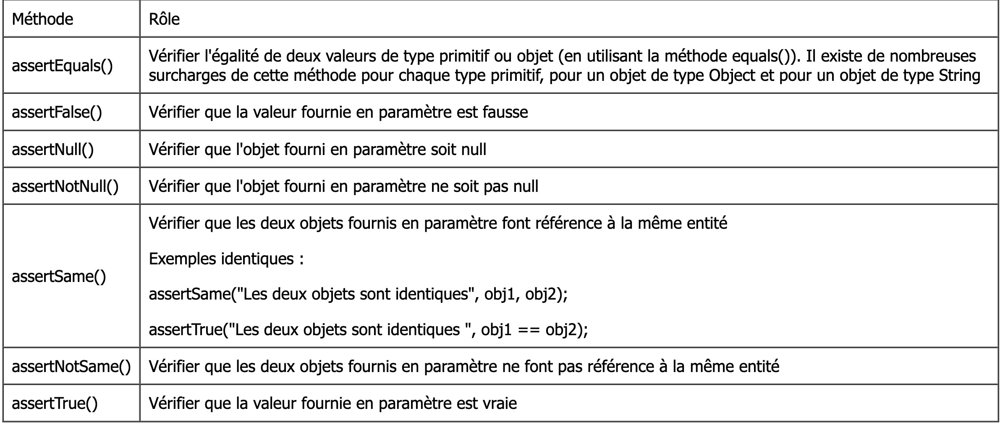


### Limitation du temps de test

JUnit 4 propose une fonctionnalité rudimentaire pour vérifier qu'un cas de tests s'exécute dans un temps maximum donné.

L'attribut timeout de l'annotation @Test attend comme valeur un délai maximum d'exécution exprimé en millisecondes.	

```java
  @Test(timeout=100)
  public void compteur() {
    for(long i = 0 ; i < 999999999; i++) { long a = i + 1; }
  }

```


### Organisation des tests

Il est généralement préférable de n'avoir qu'un seul assert par test car un test ne devrait avoir qu'une seule raison d'échouer.

---


### IPokemonFactoryTest

```java
package fr.univavignon.pokedex.api;

import org.junit.*;
import static org.junit.Assert.*;
import org.mockito.Mockito;

public class IPokemonFactoryTest {

    private IPokemonFactory pokemonFactory;
    private Pokemon Bulbizarre;

    @Before
    public void setUp() {
        // Crée un mock pour l'usine de création de Pokemon
        pokemonFactory = Mockito.mock(IPokemonFactory.class);

        // Crée une instance fictive de Pokemon pour le test
        Bulbizarre = new Pokemon(0, "Bulbizarre", 126, 126, 90, 613, 64, 4000, 4, 56.0);

        // Définir le comportement du mock pour créer le Pokemon
        Mockito.when(pokemonFactory.createPokemon(0, 613, 64, 4000, 4)).thenReturn(Bulbizarre);
    }

    @Test
    public void testCreatePokemon() {
        // Appeler la méthode testée
        Pokemon result = pokemonFactory.createPokemon(0, 613, 64, 4000, 4);

        // Vérifier que les valeurs du Pokemon sont correctes
        assertEquals(0, result.getIndex());
        assertEquals("Bulbizarre", result.getName());
        assertEquals(126, result.getAttack());
        assertEquals(126, result.getDefense());
        assertEquals(90, result.getStamina());
        assertEquals(613, result.getCp());
        assertEquals(64, result.getHp());
        assertEquals(4000, result.getDust());
        assertEquals(4, result.getCandy());
        assertEquals(56.0, result.getIv(), 0.01);

        // Vérifie que la méthode createPokemon a été appelée une fois avec les bons paramètres
        Mockito.verify(pokemonFactory).createPokemon(0, 613, 64, 4000, 4);
    }

    @After
    public void tearDown() {
        Bulbizarre = null;
    }
}

```

### Explications :

L'ajout de `0.01` dans l'appel de la méthode `assertEquals(56.0, result.getIv(), 0.01)` est nécessaire car les valeurs de type **double** ou **float** (nombres à virgule flottante) peuvent avoir de légères imprécisions en raison de la manière dont elles sont représentées en mémoire.

### Explication détaillée :

Les calculs en virgule flottante ne sont pas toujours exacts, et il peut y avoir de petites erreurs d'arrondi. Pour cette raison, lorsque tu compares deux valeurs en virgule flottante dans un test, il est recommandé de fournir une **marge d'erreur** (aussi appelée **delta**) qui spécifie à quel point les deux valeurs peuvent différer tout en étant considérées comme égales.

- **56.0** est la valeur attendue.
- **result.getIv()** est la valeur obtenue lors du test.
- **0.01** est la marge d'erreur acceptable (le delta) entre ces deux valeurs. Ici, cela signifie que les deux valeurs seront considérées comme égales tant que la différence entre elles est inférieure ou égale à 0.01.

### Pourquoi c'est important ?

Si tu essayais de comparer directement deux nombres en virgule flottante sans ce delta, même des différences infimes dues à l'arrondi ou aux calculs pourraient faire échouer le test, même si les valeurs sont pratiquement identiques. Le delta assure que ton test réussit même s'il y a de petites imprécisions.

### Exemple concret :

Si `result.getIv()` renvoie `56.001`, le test passerait parce que la différence avec `56.0` est de `0.001`, ce qui est inférieur au delta de `0.01`.


---

### IPokedexFactoryTest

```java
package fr.univavignon.pokedex.api;

import org.junit.*;
import static org.junit.Assert.*;
import org.mockito.Mockito;

public class IPokedexFactoryTest {

    private IPokedexFactory pokedexFactory; // un mock pour la classe que l'on veut tester
    private IPokemonMetadataProvider metadataProvider; // un mock pour isoler l'interface
    private IPokemonFactory pokemonFactory; // un mock pour isoler l'interface
    private IPokedex pokedex; // un mock pour simuler l'objet retourné par la méthode  createPokedex()

    @Before
    public void initialiser() {
        // Créer des mocks pour IPokemonMetadataProvider et IPokemonFactory
        metadataProvider = Mockito.mock(IPokemonMetadataProvider.class);
        pokemonFactory = Mockito.mock(IPokemonFactory.class);

        // Créer un mock pour IPokedexFactory
        pokedexFactory = Mockito.mock(IPokedexFactory.class);

        // Créer un mock pour IPokedex
        pokedex = Mockito.mock(IPokedex.class);

        // Définir le comportement du mock pokedexFactory
        Mockito.when(pokedexFactory.createPokedex(metadataProvider, pokemonFactory)).thenReturn(pokedex);
    }

    @Test
    public void testCreatePokedex() {
        // Appeler la méthode testée
        IPokedex createdPokedex = pokedexFactory.createPokedex(metadataProvider, pokemonFactory);

        // Vérifier que l'objet retourné n'est pas null
        assertNotNull(createdPokedex);

        // Vérifier que le pokedex retourné est bien celui attendu
        assertEquals(pokedex, createdPokedex);

        // Vérifier que la méthode createPokedex a bien été appelée avec les bons arguments
        Mockito.verify(pokedexFactory).createPokedex(metadataProvider, pokemonFactory);
    }

    @After
    public void nettoyer() {
        pokedex = null;
        metadataProvider = null;
        pokemonFactory = null;
    }
}

```


---

### IPokedexTest

```java
package fr.univavignon.pokedex.api;

import org.junit.*;
import static org.junit.Assert.*;
import org.mockito.Mockito;

import java.util.ArrayList;
import java.util.Comparator;
import java.util.List;

public class IPokedexTest {

    private IPokedex pokedex;
    private Pokemon bulbizarre;
    private Pokemon aquali;

    @Before
    public void initialiser() throws PokedexException {
        // Créer un mock pour l'interface IPokedex
        pokedex = Mockito.mock(IPokedex.class);

        // Créer des objets Pokémon pour les tests
        bulbizarre = new Pokemon(0, "Bulbizarre", 126, 126, 90, 613, 64, 4000, 4, 56.0);
        aquali = new Pokemon(133, "Aquali", 186, 168, 260, 2729, 202, 5000, 4, 100.0);

        // Définir le comportement pour la méthode getPokemons
        List<Pokemon> pokemons = new ArrayList<>();
        pokemons.add(bulbizarre);
        pokemons.add(aquali);
        Mockito.when(pokedex.getPokemons()).thenReturn(pokemons);

        // Définir le comportement du mock pour la méthode addPokemon
        Mockito.when(pokedex.addPokemon(bulbizarre)).thenReturn(0);
        Mockito.when(pokedex.addPokemon(aquali)).thenReturn(133);

        // Définir le comportement du mock pour la méthode size
        Mockito.when(pokedex.size()).thenReturn(2);

        // Définir le comportement du mock pour la méthode getPokemon
        Mockito.when(pokedex.getPokemon(0)).thenReturn(bulbizarre);
        Mockito.when(pokedex.getPokemon(133)).thenReturn(aquali);
    }

    @Test
    public void testAddPokemon() {
        // Ajouter des pokemons et vérifier les indices retournés
        int indexBulbizarre = pokedex.addPokemon(bulbizarre);
        int indexAquali = pokedex.addPokemon(aquali);

        assertEquals(0, indexBulbizarre);
        assertEquals(133, indexAquali); // Correction ici
    }

    @Test
    public void testSize() {
        // Vérifier que la taille du pokédex est correcte
        assertEquals(2, pokedex.size());
    }

    @Test
    public void testGetPokemon() throws PokedexException {
        // Récupérer des pokemons par leur index et vérifier leurs données
        Pokemon resultatBulbizarre = pokedex.getPokemon(0);
        Pokemon resultatAquali = pokedex.getPokemon(133); // Correction ici

        assertEquals(bulbizarre, resultatBulbizarre);
        assertEquals(aquali, resultatAquali);
    }

    @Test
    public void testGetPokemons() {
        // Vérifier que la liste des pokemons est correcte
        List<Pokemon> pokemons = pokedex.getPokemons();
        assertNotNull(pokemons);
        assertEquals(2, pokemons.size());
        assertEquals(bulbizarre, pokemons.get(0));
        assertEquals(aquali, pokemons.get(1));
    }

    @Test
    public void testGetPokemonsSorted() {
        // Créer un comparateur pour trier les pokemons par index
        Comparator<Pokemon> comparator = Comparator.comparingInt(Pokemon::getIndex);

        // Définir le comportement pour getPokemons avec un tri
        List<Pokemon> sortedPokemons = new ArrayList<>();
        sortedPokemons.add(bulbizarre);
        sortedPokemons.add(aquali);
        Mockito.when(pokedex.getPokemons(comparator)).thenReturn(sortedPokemons);

        // Vérifier que la liste triée est correcte
        List<Pokemon> pokemons = pokedex.getPokemons(comparator);
        assertEquals(bulbizarre, pokemons.get(0));
        assertEquals(aquali, pokemons.get(1));
    }

    @After
    public void nettoyer() {
        bulbizarre = null;
        aquali = null;
    }
}

```


---

### IPokemonTrainerFactoryTest

```java
package fr.univavignon.pokedex.api;

import org.junit.*;
import static org.junit.Assert.*;
import org.mockito.Mockito;

public class IPokemonTrainerFactoryTest {

    private IPokemonTrainerFactory pokemonTrainerFactory; // mock pour tester l'interface
    private IPokedexFactory pokedexFactory; // // mock pour isoler l'inetrface
    private IPokedex pokedex; // mock pour isoler l'interface

    @Before
    public void initialiser() {
        // Créer un mock pour IPokemonTrainerFactory
        pokemonTrainerFactory = Mockito.mock(IPokemonTrainerFactory.class);

        // Créer des mocks pour les dépendances
        pokedexFactory = Mockito.mock(IPokedexFactory.class);
        pokedex = Mockito.mock(IPokedex.class);

        // Définir le comportement de la fabrique de pokédex
        Mockito.when(pokedexFactory.createPokedex(Mockito.any(), Mockito.any())).thenReturn(pokedex);

        // Simuler la création d'un PokemonTrainer
        PokemonTrainer trainer = new PokemonTrainer("Ash", Team.VALOR, pokedex);
        Mockito.when(pokemonTrainerFactory.createTrainer("Ash", Team.VALOR, pokedexFactory)).thenReturn(trainer);
    }

    @Test
    public void testCreateTrainer() {
        // Créer un dresseur via la fabrique
        PokemonTrainer trainer = pokemonTrainerFactory.createTrainer("Ash", Team.VALOR, pokedexFactory);

        // Vérifier que le nom, l'équipe et le pokédex sont corrects
        assertEquals("Ash", trainer.getName());
        assertEquals(Team.VALOR, trainer.getTeam());
        assertEquals(pokedex, trainer.getPokedex());
    }

    @After
    public void nettoyer() {
        // Libérer les ressources
        pokemonTrainerFactory = null;
        pokedexFactory = null;
        pokedex = null;
    }
}

```


## TP4


**Sites:**

https://app.circleci.com/

https://app.codecov.io/github/olfabre

#### Épisode 1 - Code coverage

On souhaite obtenir des indicateurs de pertinence après avoir réalisé des tests.

Pour la pourcentage de couverture (Code Coverage), nous allons utiliser la plateforme https://about.codecov.io/

**Etape 1:** on doit s'identifier sur la plateforme avec ses identifications de GitHub 
voci mon lien: https://app.codecov.io/github/olfabre


**Etape 2:** sélection et ajout de notre repository

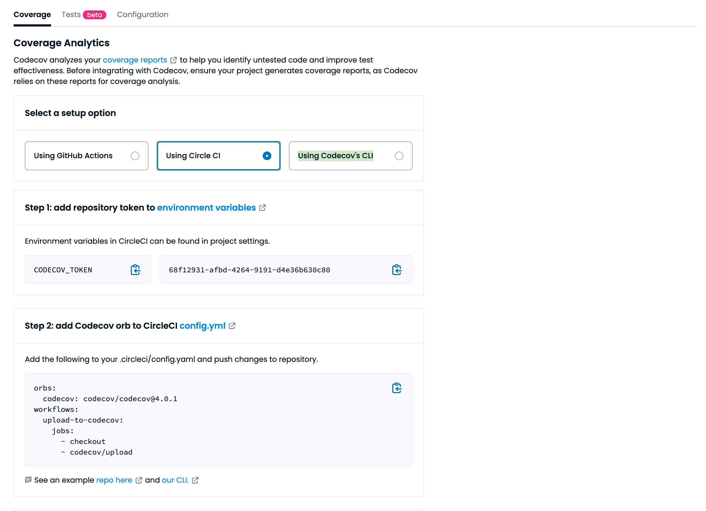

**Etape 3:** dans les paramètrages, on choisi "Using Circle CI"

Copiez le token dans le press papier:
CODECOV_TOKEN = 68f12931-afbd-4264-9191-d4e36b630c80


Etape 4: configuration de circleCI dans notre projet


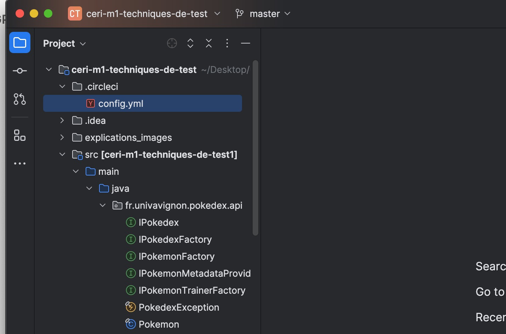


nous avions le code 

```yaml
version: 2.1

executors:
  maven-executor:
    docker:
      - image: maven:3.8.4-openjdk-11  # Utilisation d'une image avec Maven et OpenJDK 11

jobs:
  build:
    executor: maven-executor  # Utilisation de l'exécuteur défini ci-dessus
    steps:
      - checkout  # Vérifier le code source
      - run:
          name: Run Maven tests
          command: mvn test  # Exécuter les tests unitaires avec Maven

workflows:
  version: 2
  build:
    jobs:
      - build:
          filters:
            branches:
              only:
                - master  # Exécu

```


Pour intégrer l'orb Codecov dans votre configuration existante tout en conservant votre exécuteur `maven-executor`, il vous suffit de faire quelques ajustements dans votre fichier `.circleci/config.yml`. Voici comment faire :

1. **Ajoutez l'orb Codecov** au début du fichier.
2. **Modifiez le workflow** pour inclure l'étape `codecov/upload` après l'exécution des tests.

Voici à quoi devrait ressembler votre fichier `.circleci/config.yml` après modification :

```yaml
# Use the latest 2.1 version of CircleCI pipeline process engine.
# See: https://circleci.com/docs/configuration-reference
version: 2.1

# Import the Codecov orb
orbs:
  codecov: codecov/codecov@4.0.1
# Define a job to be invoked later in a workflow.
# See: https://circleci.com/docs/jobs-steps/#jobs-overview & https://circleci.com/docs/configuration-reference/#jobs
jobs:
  # Below is the definition of your job to build and test your app, you can rename and customize it as you want.
  build-and-test:
    # Specify the execution environment. You can specify an image from Docker Hub or use one of our convenience images from CircleCI's Developer Hub.
    # See: https://circleci.com/docs/executor-intro/ & https://circleci.com/docs/configuration-reference/#executor-job
    docker:
      # Specify the version you desire here
      # See: https://circleci.com/developer/images/image/cimg/openjdk
      - image: cimg/openjdk:21.0

    # Add steps to the job
    # See: https://circleci.com/docs/jobs-steps/#steps-overview & https://circleci.com/docs/configuration-reference/#steps
    steps:
      # Checkout the code as the first step.
      - checkout

      # Use mvn clean and package as the standard maven build phase
      - run:
          name: Build
          command: mvn -B -DskipTests clean package

      # Then run your tests!
      - run:
          name: Test
          command: mvn test

      # Generate the JaCoCo report after running the tests.
      - run:
          name: Generate Code Coverage Report
          command: mvn jacoco:report # Lister le contenu du dossier

      # Add the Checkstyle report generation step
      - run:
          name: Generate Checkstyle Report
          command: mvn checkstyle:checkstyle  # Lister les rapports de tests

      # Upload the coverage report to Codecov.
      - run:
          name: Upload to Codecov
          command: bash <(curl -s https://codecov.io/bash) -t $CODECOV_TOKEN -s target/site/jacoco -r "olfabre/ceri-m1-techniques-de-test"


# Orchestrate jobs using workflows
# See: https://circleci.com/docs/workflows/ & https://circleci.com/docs/configuration-reference/#workflows
workflows:
  sample: # This is the name of the workflow, feel free to change it to better match your workflow.
    # Inside the workflow, you define the jobs you .. want to run.
    jobs:
      - build-and-test:
          filters:
            branches:
              only:
                - master
```


### Explications des ajouts :

- **`orbs`** : Cela déclare l'orb Codecov, qui simplifie l'étape d'envoi du rapport.
- **`codecov/upload`** : Cette étape upload le rapport de couverture généré par JaCoCo vers Codecov.
- **`token: CODECOV_TOKEN`** : Assurez-vous d'avoir ajouté le `CODECOV_TOKEN` dans les variables d'environnement de votre projet CircleCI sous **Project Settings > Environment Variables**.

Une fois ces modifications faites, validez et poussez les changements dans votre repository. CircleCI devrait alors exécuter les tests, générer les rapports de couverture et les publier automatiquement sur Codecov.


J'ai modifié le fichier pom.xml pour Maven


```xml
<project xmlns="http://maven.apache.org/POM/4.0.0"
         xmlns:xsi="http://www.w3.org/2001/XMLSchema-instance"
         xsi:schemaLocation="http://maven.apache.org/POM/4.0.0 http://maven.apache.org/xsd/maven-4.0.0.xsd">
    <modelVersion>4.0.0</modelVersion>

    <groupId>fr.univavignon</groupId>
    <artifactId>ceri-m1-techniques-de-test</artifactId>
    <version>1.0-SNAPSHOT</version>
    <name>CERI M1 Techniques de Test</name>
    <description>Projet pour l'apprentissage des techniques de test d'API.</description>

    <properties>
        <maven.compiler.source>1.8</maven.compiler.source>
        <maven.compiler.target>1.8</maven.compiler.target>
    </properties>

    <dependencies>
        <!-- Dépendance pour JUnit -->
        <dependency>
            <groupId>junit</groupId>
            <artifactId>junit</artifactId>
            <version>4.13.2</version>
            <scope>test</scope>
        </dependency>

        <!-- Dépendance pour Mockito -->
        <dependency>
            <groupId>org.mockito</groupId>
            <artifactId>mockito-core</artifactId>
            <version>3.12.4</version>
            <scope>test</scope>
        </dependency>
    </dependencies>

    <build>
        <plugins>
            <plugin>
                <groupId>org.apache.maven.plugins</groupId>
                <artifactId>maven-compiler-plugin</artifactId>
                <version>3.8.1</version>
                <configuration>
                    <source>1.8</source>
                    <target>1.8</target>
                </configuration>
            </plugin>

            <!-- Plugin JaCoCo pour la couverture de code -->
            <plugin>
                <groupId>org.jacoco</groupId>
                <artifactId>jacoco-maven-plugin</artifactId>
                <version>0.8.7</version> <!-- Utilisez la dernière version disponible -->
                <executions>
                    <execution>
                        <goals>
                            <goal>prepare-agent</goal>
                        </goals>
                    </execution>
                    <execution>
                        <id>report</id>
                        <phase>test</phase>
                        <goals>
                            <goal>report</goal>
                        </goals>
                    </execution>
                </executions>
            </plugin>
            <plugin>
                <groupId>org.apache.maven.plugins</groupId>
                <artifactId>maven-surefire-plugin</artifactId>
                <version>2.22.2</version>
            </plugin>
        </plugins>
        <sourceDirectory>src/main/java</sourceDirectory>
        <testSourceDirectory>src/test/java</testSourceDirectory>
    </build>
</project>

```


#### Épisode 2 - Badger Badger Badger

Nous allons placer les badges CircleCI et pour la couverture de test sur mon fichier README.md

##### CircleCI

Dans Project Settings / Status Badges , un outil est disponible pour générer des badges de statut CircleCI.

[](https://dl.circleci.com/status-badge/redirect/circleci/7MzTkwBFxHK2MkeUAifbjS/2LAHbRt645vW3tJZXN6rXF/tree/master)


##### CodeCov

Dans Configuration / Badges & Graphsn, un outil est disponible pour générér des badges de couverture pour mon dépôt **olfabre/ceri-m1-techniques-de-test**

[](https://codecov.io/github/olfabre/ceri-m1-techniques-de-test)


#### Épisode 3 - Make it work !

Je vais développer les implémentations des interfaces en maintenant un niveau de qualité optimal.

Voici le diagramme de classes


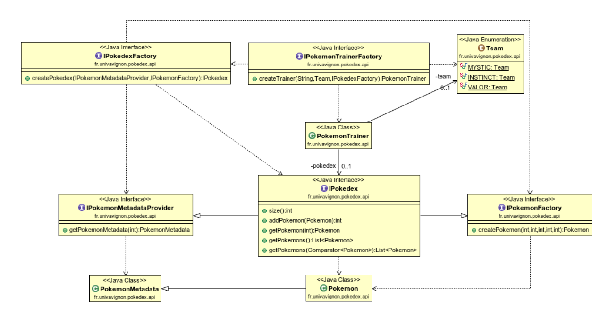

Nous allons implémenter les méthodes de l'interface `IPokedex` qui étend les interfaces `IPokemonMetadataProvider` et `IPokemonFactory` dans une nouvelle classe`PokedexImplementation.java`

Nous allons tester cette nouvelle classe à partir de la classe PokedexImplementationTest.java

==PokedexImplementation.java==


```java
package fr.univavignon.pokedex.api;

import java.util.ArrayList;
import java.util.Collections;
import java.util.Comparator;
import java.util.List;


public class PokedexImplementation implements IPokedex {

    // Liste pour stocker les Pokémon ajoutés au Pokédex
    private List<Pokemon> pokemons;


    // Constructeur
    public PokedexImplementation() {
        this.pokemons = new ArrayList<>();
    }


    /**
     * Retourne le nombre de Pokémon dans ce Pokédex.
     *
     * @return Nombre de Pokémon dans ce Pokédex.
     */
    @Override
    public int size() {
        return pokemons.size();
    }


    /**
     * Ajoute un Pokémon au Pokédex et retourne son index unique.
     *
     * @param pokemon Pokémon à ajouter.
     * @return Index de ce Pokémon dans le Pokédex.
     */
    @Override
    public int addPokemon(Pokemon pokemon) {
        pokemons.add(pokemon);
        return pokemons.size() - 1; // Retourne l'index du dernier Pokémon ajouté (indice qui commence à zéro)
    }


    /**
     * Récupère un Pokémon par son ID.
     *
     * @param id Identifiant unique dans le Pokédex.
     * @return Pokémon correspondant à cet ID.
     * @throws PokedexException Si l'ID n'est pas valide.
     */
    @Override
    public Pokemon getPokemon(int id) throws PokedexException {
        if (id < 0 || id >= pokemons.size()) {
            throw new PokedexException("ID de Pokémon invalide.");
        }
        return pokemons.get(id);
    }


    /**
     * Retourne une liste non modifiable de tous les Pokémon dans le Pokédex.
     *
     * @return Liste non modifiable de tous les Pokémon.
     */
    @Override
    public List<Pokemon> getPokemons() {
        return Collections.unmodifiableList(pokemons);
    }


    /**
     * Retourne une liste triée de tous les Pokémon dans le Pokédex en utilisant
     * un comparateur spécifique.
     *
     * @param order Comparateur pour le tri.
     * @return Liste triée et non modifiable de tous les Pokémon.
     */
    @Override
    public List<Pokemon> getPokemons(Comparator<Pokemon> order) {
        List<Pokemon> sortedPokemons = new ArrayList<>(pokemons);
        sortedPokemons.sort(order);
        return Collections.unmodifiableList(sortedPokemons);
    }


    /**
     * Crée une instance de Pokémon en utilisant les paramètres fournis.
     *
     * @param index Index du Pokémon.
     * @param cp Points de combat du Pokémon.
     * @param hp Points de vie du Pokémon.
     * @param dust Poussière requise pour améliorer le Pokémon.
     * @param candy Bonbons requis pour améliorer le Pokémon.
     * @return Instance de Pokémon créée avec les valeurs fournies.
     */
    @Override
    public Pokemon createPokemon(int index, int cp, int hp, int dust, int candy) {

            double iv = 50.0; // Par exemple, valeur de perfection IV par défaut
            return new Pokemon(index, "olivier", 100, 100, 100, cp, hp, dust, candy, iv);
    }


    /**
     * Récupère et retourne les métadonnées du Pokémon correspondant à l'index fourni.
     *
     * @param index Index du Pokémon dont les métadonnées doivent être récupérées.
     * @return Métadonnées du Pokémon.
     * @throws PokedexException Si l'index donné n'est pas valide.
     */
    @Override
    public PokemonMetadata getPokemonMetadata(int index) throws PokedexException {
        if (index < 0 || index >= 150) { // Supposons un maximum de 150 Pokémon
            throw new PokedexException("Index de Pokémon invalide.");
        }
        return new PokemonMetadata(index, "olivier", 100, 100, 100);
    }
}
```


==PokedexImplementationTest.java==


```java
package fr.univavignon.pokedex.api;

import org.junit.*;
import static org.junit.Assert.*;
import org.mockito.Mockito;

import java.util.Comparator;
import java.util.List;


public class PokedexImplementationTest {

    private PokedexImplementation pokedex;
    private Pokemon pokemon;

    @Before
    public void initialiser() {
        pokedex = new PokedexImplementation();
        pokemon = new Pokemon(0, "Pikachu", 126, 126, 90, 500, 60, 4000, 3, 56.0);
    }

    @Test
    public void testSize() {
        assertEquals(0, pokedex.size());
        pokedex.addPokemon(pokemon);
        assertEquals(1, pokedex.size());
    }

    @Test
    public void testAddPokemon() {
        int index = pokedex.addPokemon(pokemon);
        assertEquals(0, index);
        assertEquals(1, pokedex.size());
    }

    @Test
    public void testGetPokemon() throws PokedexException {
        pokedex.addPokemon(pokemon);
        Pokemon retrievedPokemon = pokedex.getPokemon(0);
        assertEquals(pokemon, retrievedPokemon);

        assertThrows(PokedexException.class, () -> pokedex.getPokemon(1));
    }

    @Test
    public void testGetPokemons() {
        pokedex.addPokemon(pokemon);
        List<Pokemon> pokemons = pokedex.getPokemons();
        assertEquals(1, pokemons.size());
        assertEquals(pokemon, pokemons.get(0));
    }

    @Test
    public void testGetPokemonsWithOrder() {
        Pokemon pokemon2 = new Pokemon(1, "Bulbasaur", 118, 118, 90, 300, 45, 3000, 3, 45.0);
        pokedex.addPokemon(pokemon);
        pokedex.addPokemon(pokemon2);

        List<Pokemon> sortedPokemons = pokedex.getPokemons(Comparator.comparing(Pokemon::getCp).reversed());
        assertEquals(pokemon, sortedPokemons.get(0));
        assertEquals(pokemon2, sortedPokemons.get(1));
    }

    @Test
    public void testCreatePokemon() {
        Pokemon createdPokemon = pokedex.createPokemon(0, 500, 60, 4000, 3);
        assertNotNull(createdPokemon);
        assertEquals(0, createdPokemon.getIndex());
        assertEquals(500, createdPokemon.getCp());
    }

    @Test
    public void testGetPokemonMetadata() throws PokedexException {
        PokemonMetadata metadata = pokedex.getPokemonMetadata(0);
        assertNotNull(metadata);
        assertEquals(0, metadata.getIndex());
        assertEquals("olivier", metadata.getName());
        assertThrows(PokedexException.class, () -> pokedex.getPokemonMetadata(150));
    }

    @After
    public void nettoyer() {
        pokedex = null;
        pokemon = null;
    }


}
```


# TP5 Bulbapedia


## Épisode 1

Nous allons intégrer l'outil checkstyle dans notre processus afin de nous assurer que notre code respecte un ensemble de critères de qualité. Nous allons intégrer Checkstyle et l'utiliser avec CircleCI.

On pensera également à intégrer le badge dans le fichier README.md présentant une versions condensée des conclusions du rapport généré.


Etape 1:

Nous allons ajouter le plugin Checkstyle au fichier `pom.xml`

Modifiez la section `<plugins>` dans le fichier `pom.xml` pour inclure le plugin

```xml
<project xmlns="http://maven.apache.org/POM/4.0.0"
         xmlns:xsi="http://www.w3.org/2001/XMLSchema-instance"
         xsi:schemaLocation="http://maven.apache.org/POM/4.0.0 http://maven.apache.org/xsd/maven-4.0.0.xsd">
    <modelVersion>4.0.0</modelVersion>

    <groupId>fr.univavignon</groupId>
    <artifactId>ceri-m1-techniques-de-test</artifactId>
    <version>1.0-SNAPSHOT</version>
    <name>CERI M1 Techniques de Test</name>
    <description>Projet pour l'apprentissage des techniques de test d'API.</description>

    <properties>
        <maven.compiler.source>1.8</maven.compiler.source>
        <maven.compiler.target>1.8</maven.compiler.target>
        <project.build.sourceEncoding>UTF-8</project.build.sourceEncoding> <!-- Encodage par défaut -->
    </properties>

    <dependencies>
        <!-- Dépendance pour JUnit -->
        <dependency>
            <groupId>junit</groupId>
            <artifactId>junit</artifactId>
            <version>4.13.2</version>
            <scope>test</scope>
        </dependency>

        <!-- Dépendance pour Mockito -->
        <dependency>
            <groupId>org.mockito</groupId>
            <artifactId>mockito-core</artifactId>
            <version>3.12.4</version>
            <scope>test</scope>
        </dependency>
    </dependencies>

    <build>
        <plugins>
            <plugin>
                <groupId>org.apache.maven.plugins</groupId>
                <artifactId>maven-compiler-plugin</artifactId>
                <version>3.8.1</version>
                <configuration>
                    <source>1.8</source>
                    <target>1.8</target>
                </configuration>
            </plugin>

            <!-- Plugin Checkstyle -->
            <plugin>
                <groupId>org.apache.maven.plugins</groupId>
                <artifactId>maven-checkstyle-plugin</artifactId>
                <version>3.2.0</version>
                <configuration>
                    <configLocation>checkstyle.xml</configLocation>
                    <encoding>UTF-8</encoding>
                    <consoleOutput>true</consoleOutput>
                    <failsOnError>true</failsOnError>
                    <outputFile>target/checkstyle-result.xml</outputFile>
                </configuration>
            </plugin>

            <!-- Plugin JaCoCo pour la couverture de code -->
            <plugin>
                <groupId>org.jacoco</groupId>
                <artifactId>jacoco-maven-plugin</artifactId>
                <version>0.8.7</version> <!-- Utilisez la dernière version disponible -->
                <executions>
                    <execution>
                        <goals>
                            <goal>prepare-agent</goal>
                        </goals>
                    </execution>
                    <execution>
                        <id>report</id>
                        <phase>test</phase>
                        <goals>
                            <goal>report</goal>
                        </goals>
                    </execution>
                </executions>
            </plugin>
            <plugin>
                <groupId>org.apache.maven.plugins</groupId>
                <artifactId>maven-surefire-plugin</artifactId>
                <version>2.22.2</version>
            </plugin>
        </plugins>
        <sourceDirectory>src/main/java</sourceDirectory>
        <testSourceDirectory>src/test/java</testSourceDirectory>
    </build>
</project>
```


**`configLocation`** : Spécifie le fichier de configuration Checkstyle. Placez un fichier nommé `checkstyle.xml` dans le dossier `src/main/resources` ou à la racine du projet.

**`failsOnError`** : Provoque une erreur si Checkstyle trouve des violations


Etape 2:

Nous allons créer un fichier  `checkstyle.xml` pour définir les règles de style de code.

```xml
<!DOCTYPE module PUBLIC
        "-//Puppy Crawl//DTD Check Configuration 1.3//EN"
        "https://checkstyle.org/dtds/configuration_1_3.dtd">

<module name="Checker">
    <module name="TreeWalker">
        <module name="JavadocMethod">
            <property name="scope" value="public"/>
        </module>
        <module name="WhitespaceAround"/>
        <module name="AvoidStarImport"/>
        <module name="FinalLocalVariable"/>
    </module>
</module>

```

on place ce fichier au même niveau que pom.xml


Etape 3:

Nous allons ajouter Checkstyle à CircleCI

Pour cela, nous allons modifier notre fichier `.circleci/config.yml` pour exécuter Checkstyle pendant la pipeline.

```xml
# Use the latest 2.1 version of CircleCI pipeline process engine.
# See: https://circleci.com/docs/configuration-reference
version: 2.1

# Import the Codecov orb
orbs:
  codecov: codecov/codecov@4.0.1

# Define a job to be invoked later in a workflow.
jobs:
  build-and-test:
    docker:
      - image: cimg/openjdk:21.0
    steps:
      # Checkout the code as the first step.
      - checkout

      # Build the project
      - run:
          name: Build
          command: mvn -B -DskipTests clean package

      # Run tests
      - run:
          name: Test
          command: mvn test

      # Generate the JaCoCo report
      - run:
          name: Generate Code Coverage Report
          command: mvn jacoco:report

      # Add Checkstyle verification
      - run:
          name: Run Checkstyle Verification
          command: mvn checkstyle:check

      # Generate Checkstyle HTML report
      - run:
          name: Generate Checkstyle HTML Report
          command: mvn checkstyle:checkstyle

      # Upload the coverage report to Codecov
      - run:
          name: Upload to Codecov
          command: bash <(curl -s https://codecov.io/bash) -t $CODECOV_TOKEN -s target/site/jacoco -r "olfabre/ceri-m1-techniques-de-test"

workflows:
  sample:
    jobs:
      - build-and-test:
          filters:
            branches:
              only:
                - master

```

Une étape `Generate Checkstyle HTML Report` exécute `mvn checkstyle:checkstyle` pour produire un rapport HTML de Checkstyle.

### Vérification

- Lorsque CircleCI exécute la pipeline, les étapes Checkstyle arrêteront la construction si des violations sont trouvées (grâce à `failsOnError` dans le `pom.xml`).
- Vous pouvez examiner les rapports générés dans `target/site/checkstyle.html` ou dans la console.


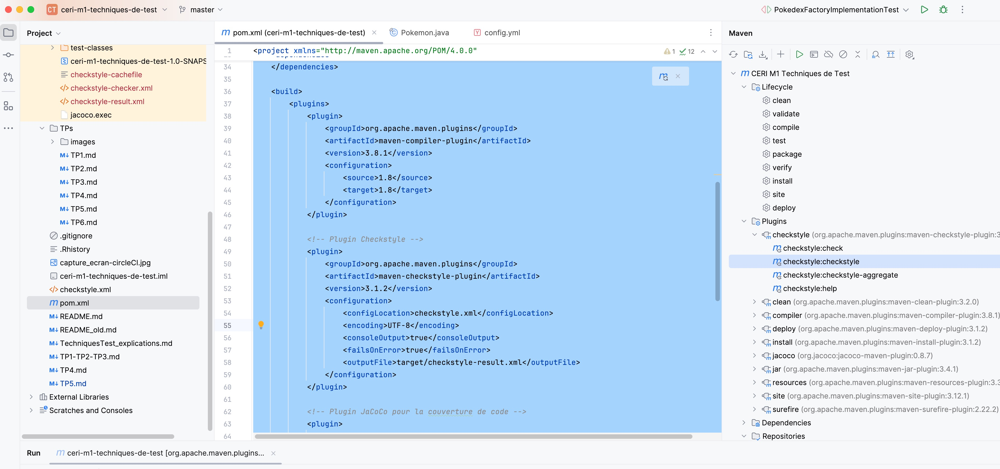

Pour vérifier le checkstyle on doit cliquer dans maven / plugins / checkstyle:checkstyle

Nous pouvons aussi corriger le code  

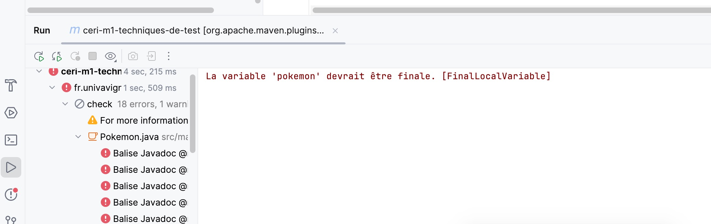


les erreurs checkstyle sont aussi notifiées sur CircleCI

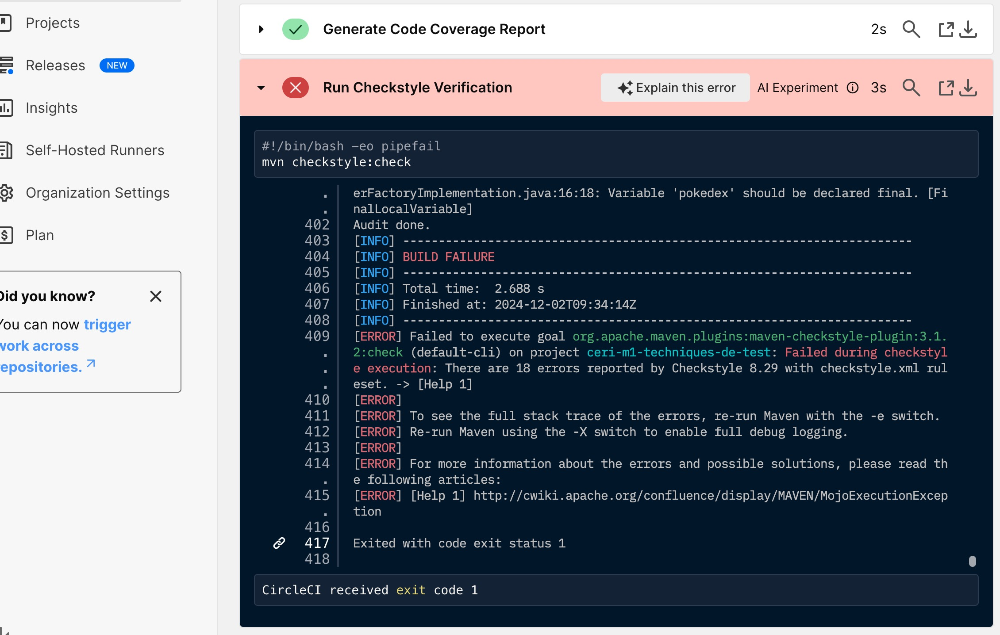


Nous pouvons ajoutés des verifications supplémentaires

```bash
<?xml version="1.0"?>
<!DOCTYPE module PUBLIC
        "-//Checkstyle//DTD Checkstyle Configuration 1.3//EN"
        "https://checkstyle.org/dtds/configuration_1_3.dtd">

<module name="Checker">
    <module name="FileTabCharacter"/>

    <module name="FileLength">
        <property name="max" value="500"/>
    </module>

    <module name="LineLength">
        <property name="max" value="120"/>
    </module>

    <module name="TreeWalker">
        <module name="ConstantName"/>
        <module name="LocalVariableName"/>
        <module name="MemberName"/>
        <module name="MethodName"/>
        <module name="PackageName"/>
        <module name="ParameterName"/>
        <module name="StaticVariableName"/>
        <module name="TypeName"/>

        <module name="AvoidStarImport"/>
        <module name="IllegalImport"/>
        <module name="RedundantImport"/>
        <module name="UnusedImports"/>

        <module name="CyclomaticComplexity">
            <property name="max" value="20"/>
        </module>
        <module name="NPathComplexity">
            <property name="max" value="300"/>
        </module>

        <module name="MethodLength">
            <property name="max" value="100"/>
        </module>
        <module name="EmptyBlock"/>
        <module name="NeedBraces"/>

        <module name="JavadocMethod">
        </module>
        <module name="JavadocType"/>
        <module name="JavadocVariable"/>
    </module>
</module>
```


Voici une explication des vérifications et modules présents dans votre fichier `checkstyle.xml` :

### 1. **FileTabCharacter**

- **Vérification** : Ce module vérifie la présence de tabulations (`\t`) dans le fichier source. Il recommande généralement l'utilisation d'espaces au lieu de tabulations pour l'indentation.
- **But** : Assurer que les fichiers n'utilisent pas de tabulations, ce qui peut entraîner des problèmes de lisibilité dans différents éditeurs.

### 2. **FileLength**

- **Vérification** : Ce module vérifie la longueur des fichiers source. La propriété `max` spécifie la longueur maximale autorisée pour un fichier (ici, 500 lignes).
- **But** : Assurer que les fichiers ne sont pas trop longs, ce qui peut rendre le code difficile à maintenir et à lire.

### 3. **LineLength**

- **Vérification** : Ce module vérifie la longueur des lignes de code. La propriété `max` fixe la longueur maximale autorisée (ici, 120 caractères).
- **But** : Assurer que les lignes ne sont pas trop longues, ce qui rendrait le code difficile à lire, notamment sur des écrans plus petits ou dans des revues de code.

### 4. **TreeWalker**

Le module `TreeWalker` est un "module parent" qui contient plusieurs autres modules de vérification. Il permet de vérifier différentes règles sur les éléments du code.

#### Sous-modules sous `TreeWalker` :

- **ConstantName**
  - **Vérification** : Ce module vérifie que les noms des constantes respectent une convention de nommage (par exemple, tout en majuscules avec des underscores pour séparer les mots).
  - **But** : Assurer que les constantes suivent une convention de nommage standardisée.
- **LocalVariableName**
  - **Vérification** : Ce module vérifie que les noms des variables locales respectent une convention (par exemple, en camelCase).
  - **But** : Assurer que les variables locales sont nommées de manière lisible et cohérente.
- **MemberName**
  - **Vérification** : Ce module vérifie que les noms des membres (champs ou propriétés de classe) respectent une convention (souvent camelCase pour les variables d'instance).
  - **But** : Assurer que les membres sont nommés de manière claire et uniforme.
- **MethodName**
  - **Vérification** : Ce module vérifie que les noms des méthodes respectent une convention de nommage, souvent en camelCase.
  - **But** : Assurer que les méthodes sont nommées de manière claire et lisible.
- **PackageName**
  - **Vérification** : Ce module vérifie que les noms des packages respectent une convention, souvent en minuscules et en suivant une structure de domaine inversé (par exemple, `com.example.project`).
  - **But** : Assurer que les packages sont organisés de manière logique et uniforme.
- **ParameterName**
  - **Vérification** : Ce module vérifie que les noms des paramètres de méthode respectent une convention (par exemple, camelCase).
  - **But** : Assurer que les paramètres sont nommés de manière claire et cohérente.
- **StaticVariableName**
  - **Vérification** : Ce module vérifie que les noms des variables statiques respectent une convention de nommage spécifique (par exemple, en majuscules avec des underscores).
  - **But** : Assurer que les variables statiques sont nommées de manière cohérente et facilement reconnaissable.
- **TypeName**
  - **Vérification** : Ce module vérifie que les noms des types (classes, interfaces, etc.) respectent une convention de nommage (souvent en PascalCase).
  - **But** : Assurer que les types sont nommés de manière lisible et cohérente.
- **AvoidStarImport**
  - **Vérification** : Ce module vérifie que l'importation d'un package avec `*` (importation générique) est évitée. Il préfère les importations explicites.
  - **But** : Assurer que le code ne dépend pas d'importations génériques, ce qui peut rendre le code plus lisible et éviter les conflits de noms.
- **IllegalImport**
  - **Vérification** : Ce module vérifie qu'aucune importation illégale n'est présente dans le code (par exemple, des importations de classes spécifiques interdites par des règles de sécurité ou de conception).
  - **But** : Assurer que seules les importations autorisées sont présentes dans le code.
- **RedundantImport**
  - **Vérification** : Ce module vérifie qu'il n'y a pas d'importations redondantes (par exemple, importer une classe ou un package qui n'est pas utilisé).
  - **But** : Assurer qu'il n'y a pas d'importations inutiles, ce qui rend le code plus propre et plus performant.
- **UnusedImports**
  - **Vérification** : Ce module vérifie qu'il n'y a pas d'importations inutilisées dans le fichier source.
  - **But** : Assurer que le code ne contient pas d'importations inutiles, ce qui réduit la taille du code et améliore la lisibilité.

#### Vérifications sur la complexité du code :

- **CyclomaticComplexity**
  - **Vérification** : Ce module vérifie la complexité cyclomatique du code, qui mesure la complexité d'un programme en fonction du nombre de chemins indépendants dans son flux de contrôle. La propriété `max` définit la complexité maximale autorisée pour une méthode (ici, 20).
  - **But** : Assurer que le code reste compréhensible en limitant la complexité des méthodes.
- **NPathComplexity**
  - **Vérification** : Ce module vérifie la complexité de chemin NPath, qui est une mesure de la complexité d'une méthode basée sur le nombre de chemins d'exécution possibles. La propriété `max` définit la complexité maximale autorisée (ici, 300).
  - **But** : Limiter la complexité des méthodes pour rendre le code plus facile à tester et à maintenir.

#### Vérifications sur la longueur des méthodes et des blocs :

- **MethodLength**
  - **Vérification** : Ce module vérifie que la longueur des méthodes ne dépasse pas une certaine limite, définie par la propriété `max` (ici, 100 lignes).
  - **But** : Assurer que les méthodes ne deviennent pas trop longues et restent compréhensibles.
- **EmptyBlock**
  - **Vérification** : Ce module vérifie qu'il n'y a pas de blocs de code vides dans le code source (par exemple, des blocs de `if` ou de `while` sans instructions).
  - **But** : Éviter les blocs vides, qui peuvent être source d'erreurs ou de code inutilisé.
- **NeedBraces**
  - **Vérification** : Ce module vérifie que les blocs de code associés aux structures de contrôle (`if`, `for`, `while`, etc.) utilisent des accolades, même si une seule ligne est présente.
  - **But** : Assurer que le code est toujours clairement délimité, ce qui évite des erreurs lorsqu'une ligne est ajoutée ou modifiée dans le bloc.

#### Vérifications de la documentation (Javadoc) :

- **JavadocMethod**
  - **Vérification** : Ce module vérifie que les méthodes sont correctement documentées avec des commentaires Javadoc.
  - **But** : Assurer que chaque méthode est bien documentée pour clarifier son fonctionnement.
- **JavadocType**
  - **Vérification** : Ce module vérifie que les types (classes, interfaces, etc.) sont correctement documentés avec des commentaires Javadoc.
  - **But** : Assurer que chaque type est bien documenté pour décrire son rôle dans le projet.
- **JavadocVariable**
  - **Vérification** : Ce module vérifie que les variables de classe et d'instance sont correctement documentées avec des commentaires Javadoc.
  - **But** : Assurer que chaque variable importante est documentée de manière à comprendre son rôle.


Pour permettre la visualisation du badge, nous modifions le code `pom.xml`

```xml
<project xmlns="http://maven.apache.org/POM/4.0.0"
         xmlns:xsi="http://www.w3.org/2001/XMLSchema-instance"
         xsi:schemaLocation="http://maven.apache.org/POM/4.0.0 http://maven.apache.org/xsd/maven-4.0.0.xsd">
    <modelVersion>4.0.0</modelVersion>

    <groupId>fr.univavignon</groupId>
    <artifactId>ceri-m1-techniques-de-test</artifactId>
    <version>1.0-SNAPSHOT</version>
    <name>CERI M1 Techniques de Test</name>
    <description>Projet pour l'apprentissage des techniques de test d'API.</description>

    <properties>
        <maven.compiler.source>1.8</maven.compiler.source>
        <maven.compiler.target>1.8</maven.compiler.target>
        <project.build.sourceEncoding>UTF-8</project.build.sourceEncoding> <!-- Encodage par défaut -->
    </properties>

    <dependencies>
        <!-- Dépendance pour JUnit -->
        <dependency>
            <groupId>junit</groupId>
            <artifactId>junit</artifactId>
            <version>4.13.2</version>
            <scope>test</scope>
        </dependency>

        <!-- Dépendance pour Mockito -->
        <dependency>
            <groupId>org.mockito</groupId>
            <artifactId>mockito-core</artifactId>
            <version>3.12.4</version>
            <scope>test</scope>
        </dependency>
    </dependencies>

    <build>
        <plugins>
            <plugin>
                <groupId>org.apache.maven.plugins</groupId>
                <artifactId>maven-compiler-plugin</artifactId>
                <version>3.8.1</version>
                <configuration>
                    <source>1.8</source>
                    <target>1.8</target>
                </configuration>
            </plugin>

            <!-- Plugin Checkstyle -->
            <plugin>
                <groupId>org.apache.maven.plugins</groupId>
                <artifactId>maven-checkstyle-plugin</artifactId>
                <version>3.2.0</version>
                <configuration>
                    <configLocation>checkstyle.xml</configLocation>

                    <consoleOutput>true</consoleOutput>
                    <failsOnError>true</failsOnError>
                    <outputFile>target/checkstyle-result.xml</outputFile>
                </configuration>
            </plugin>
            <plugin>
                <groupId>com.github.bordertech.buildtools</groupId>
                <artifactId>badger</artifactId>
                <version>1.0.0</version>
                <executions>
                    <execution>
                        <id>verify</id>
                        <phase>verify</phase>
                        <goals>
                            <goal>badges</goal>
                        </goals>
                        <configuration>
                            <outputDir>${project.build.directory}/badges</outputDir>
                            <inputFiles>
                                <inputFile>target/checkstyle-result.xml</inputFile>
                            </inputFiles>
                        </configuration>
                    </execution>
                </executions>
            </plugin>
            <!-- Plugin JaCoCo pour la couverture de code -->
            <plugin>
                <groupId>org.jacoco</groupId>
                <artifactId>jacoco-maven-plugin</artifactId>
                <version>0.8.7</version> <!-- Utilisez la dernière version disponible -->
                <executions>
                    <execution>
                        <goals>
                            <goal>prepare-agent</goal>
                        </goals>
                    </execution>
                    <execution>
                        <id>report</id>
                        <phase>test</phase>
                        <goals>
                            <goal>report</goal>
                        </goals>
                    </execution>
                </executions>
            </plugin>
            <plugin>
                <groupId>org.apache.maven.plugins</groupId>
                <artifactId>maven-surefire-plugin</artifactId>
                <version>2.22.2</version>
            </plugin>
        </plugins>
        <sourceDirectory>src/main/java</sourceDirectory>
        <testSourceDirectory>src/test/java</testSourceDirectory>
    </build>
</project>

```


Cette configuration du plugin **Badger** dans votre `pom.xml` est bien structurée et permet d'éviter l'avertissement lié au répertoire de sortie manquant. Voici une explication détaillée de chaque partie de ce bloc et des actions qu'il effectue :

------

### **1. Structure et Rôle**

```
xml


Copier le code
<plugin>
    <groupId>com.github.bordertech.buildtools</groupId>
    <artifactId>badger</artifactId>
    <version>1.0.0</version>
```

- **groupId** et **artifactId** : Identifient le plugin Maven spécifique (ici, Badger).
- **version** : Spécifie la version utilisée.

------

### **2. Configuration des exécutions**

```
xml


Copier le code
<executions>
    <execution>
        <id>verify</id>
        <phase>verify</phase>
        <goals>
            <goal>badges</goal>
        </goals>
```

- **id** : Nom unique pour cette exécution. Ici, `verify`.
- **phase** : Phase Maven où ce plugin est exécuté. Ici, `verify`, ce qui signifie qu'il s'exécute après les tests et vérifications (comme Checkstyle).
- **goals** : Action spécifique réalisée par le plugin. Ici, la génération de badges avec `badges`.

------

### **3. Configuration du plugin**

```
xml


Copier le code
<configuration>
    <outputDir>${project.build.directory}/badges</outputDir>
    <inputFiles>
        <inputFile>target/checkstyle-result.xml</inputFile>
    </inputFiles>
</configuration>
```

- **outputDir** : Définit où seront placés les badges générés. Ici, dans `target/badges`.
- **inputFiles** : Liste des fichiers d'entrée que Badger transformera en badges. Ici, il s'agit du fichier `checkstyle-result.xml`, généré par Checkstyle.

------

### **4. Vérification et Génération**

Pour tester cette configuration, exécutez la commande suivante dans le répertoire de votre projet Maven :

```
mvn verify
```

- Étapes attendues :
  1. Le plugin Checkstyle génère le fichier `target/checkstyle-result.xml`.
  2. Le plugin Badger transforme ce fichier XML en un badge SVG, stocké dans `target/badges`.

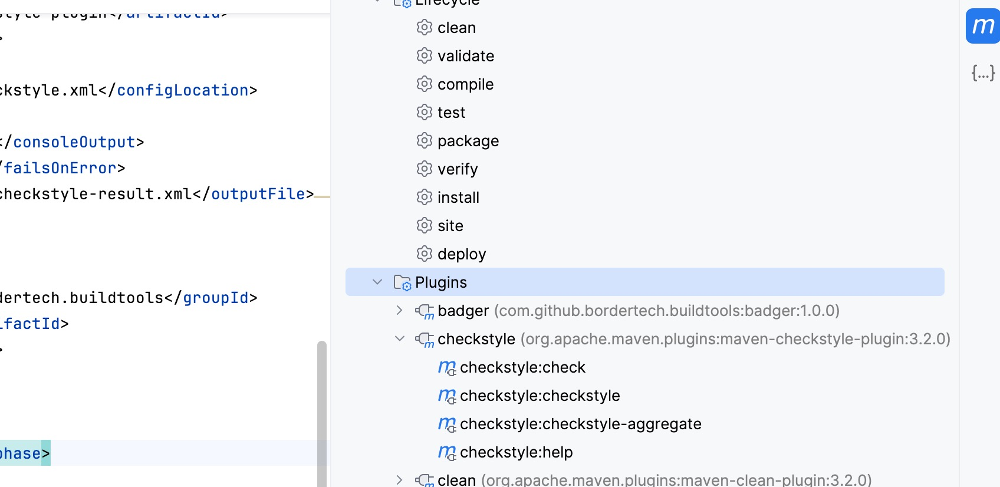

------

### **5. Points à vérifier si l'erreur persiste**

1. **Chemin du fichier Checkstyle**
   - Assurez-vous que le fichier `target/checkstyle-result.xml` est généré avant que Badger ne s'exécute. Si ce fichier manque, Badger échouera.
2. **Répertoire de sortie**
   - Vérifiez que le répertoire `target/badges` est créé automatiquement ou existe déjà. Maven le crée généralement par défaut.
3. **Versions des plugins**
   - Vérifiez que les versions des plugins **Checkstyle** et **Badger** sont compatibles.


**Check style - Verif Style**   
   


## Épisode 2

Un projet n'est rien sans sa documentation, et c'est encore mieux si elle est générée automatiquement ! Nous allons configurer notre intégration continue de manière à ce que la [Javadoc](https://www.oracle.com/java/technologies/javase/javadoc-tool.html) soit générée automatiquement et directement publiée au travers de GitHub Pages.


Pour automatiser la génération et la publication de la Javadoc ainsi que l'intégration des rapports Checkstyle via GitHub Pages, nous pouvons suivre ces étapes :

**Étape 1 : Génération de la Javadoc**

Nous devons modifier `pom.xml`

```xml
<project xmlns="http://maven.apache.org/POM/4.0.0"
         xmlns:xsi="http://www.w3.org/2001/XMLSchema-instance"
         xsi:schemaLocation="http://maven.apache.org/POM/4.0.0 http://maven.apache.org/xsd/maven-4.0.0.xsd">
    <modelVersion>4.0.0</modelVersion>

    <groupId>fr.univavignon</groupId>
    <artifactId>ceri-m1-techniques-de-test</artifactId>
    <version>1.0-SNAPSHOT</version>
    <name>CERI M1 Techniques de Test</name>
    <description>Projet pour l'apprentissage des techniques de test d'API.</description>

    <properties>
        <maven.compiler.source>1.8</maven.compiler.source>
        <maven.compiler.target>1.8</maven.compiler.target>
        <project.build.sourceEncoding>UTF-8</project.build.sourceEncoding> <!-- Encodage par défaut -->
    </properties>

    <dependencies>
        <!-- Dépendance pour JUnit -->
        <dependency>
            <groupId>junit</groupId>
            <artifactId>junit</artifactId>
            <version>4.13.2</version>
            <scope>test</scope>
        </dependency>

        <!-- Dépendance pour Mockito -->
        <dependency>
            <groupId>org.mockito</groupId>
            <artifactId>mockito-core</artifactId>
            <version>3.12.4</version>
            <scope>test</scope>
        </dependency>
    </dependencies>

    <build>
        <plugins>
            <plugin>
                <groupId>org.apache.maven.plugins</groupId>
                <artifactId>maven-compiler-plugin</artifactId>
                <version>3.8.1</version>
                <configuration>
                    <source>1.8</source>
                    <target>1.8</target>
                </configuration>
            </plugin>

            <!-- Plugin Checkstyle -->
            <plugin>
                <groupId>org.apache.maven.plugins</groupId>
                <artifactId>maven-checkstyle-plugin</artifactId>
                <version>3.2.0</version>
                <configuration>
                    <configLocation>checkstyle.xml</configLocation>

                    <consoleOutput>true</consoleOutput>
                    <failsOnError>true</failsOnError>
                    <outputFile>target/checkstyle-result.xml</outputFile>
                </configuration>
            </plugin>
            <plugin>
                <groupId>com.github.bordertech.buildtools</groupId>
                <artifactId>badger</artifactId>
                <version>1.0.0</version>
                <executions>
                    <execution>
                        <id>verify</id>
                        <phase>verify</phase>
                        <goals>
                            <goal>badges</goal>
                        </goals>
                        <configuration>
                            <outputDir>${project.build.directory}/badges</outputDir>
                            <inputFiles>
                                <inputFile>target/checkstyle-result.xml</inputFile>
                            </inputFiles>
                        </configuration>
                    </execution>
                </executions>
            </plugin>
            <!-- Plugin JaCoCo pour la couverture de code -->
            <plugin>
                <groupId>org.jacoco</groupId>
                <artifactId>jacoco-maven-plugin</artifactId>
                <version>0.8.7</version> <!-- Utilisez la dernière version disponible -->
                <executions>
                    <execution>
                        <goals>
                            <goal>prepare-agent</goal>
                        </goals>
                    </execution>
                    <execution>
                        <id>report</id>
                        <phase>test</phase>
                        <goals>
                            <goal>report</goal>
                        </goals>
                    </execution>
                </executions>
            </plugin>
            <plugin>
                <groupId>org.apache.maven.plugins</groupId>
                <artifactId>maven-surefire-plugin</artifactId>
                <version>2.22.2</version>
            </plugin>
            <plugin>
                <groupId>org.apache.maven.plugins</groupId>
                <artifactId>maven-javadoc-plugin</artifactId>
                <version>3.4.0</version>
                <executions>
                    <execution>
                        <id>generate-javadoc</id>
                        <goals>
                            <goal>javadoc</goal>
                        </goals>
                        <phase>verify</phase>
                        <configuration>
                            <reportOutputDirectory>${project.build.directory}/site/apidocs</reportOutputDirectory>
                        </configuration>
                    </execution>
                </executions>
            </plugin>
        </plugins>
        <sourceDirectory>src/main/java</sourceDirectory>
        <testSourceDirectory>src/test/java</testSourceDirectory>
    </build>
</project>

```

Cette configuration génère la Javadoc et la place dans le répertoire `target/site/apidocs`.

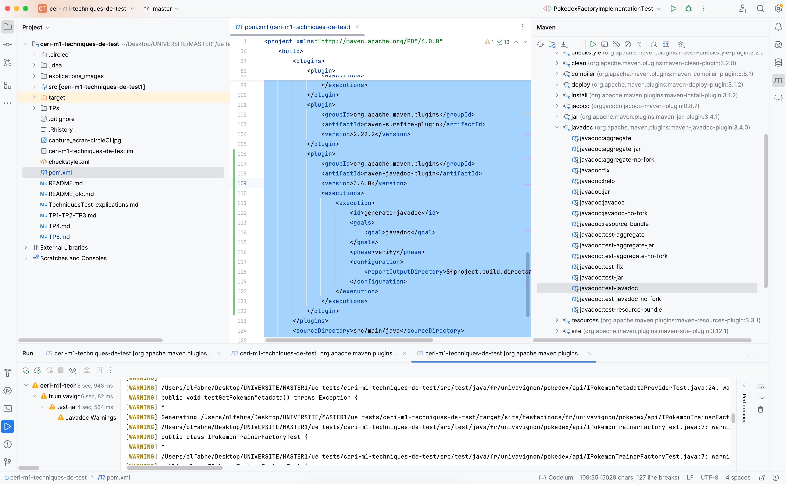


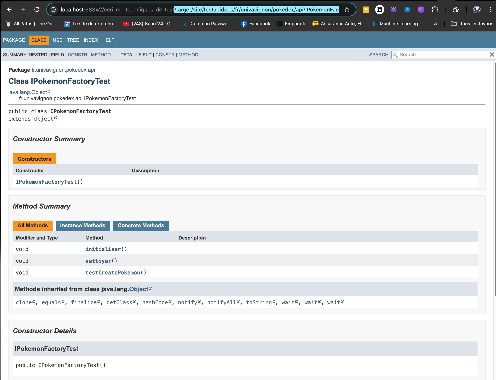


**Étape 2 : Vérification de la couverture de la Javadoc**

Nius allons vérifier la configuration au plugin Checkstyle pour vérifier la couverture de votre Javadoc.


```xml
<module name="JavadocMethod">
    <property name="scope" value="public"/>
    <property name="allowMissingParamTags" value="false"/>
    <property name="allowMissingThrowsTags" value="false"/>
</module>
```


**Étape 3 : Configuration CircleCI pour générer et déployer la Javadoc**

Ajoutez une configuration CircleCI pour générer la Javadoc, valider la qualité avec Checkstyle et publier la documentation.

Nous allons modifier le fichier ` .circleci/config.yml`

mais avant, nous devons créer un token sur github

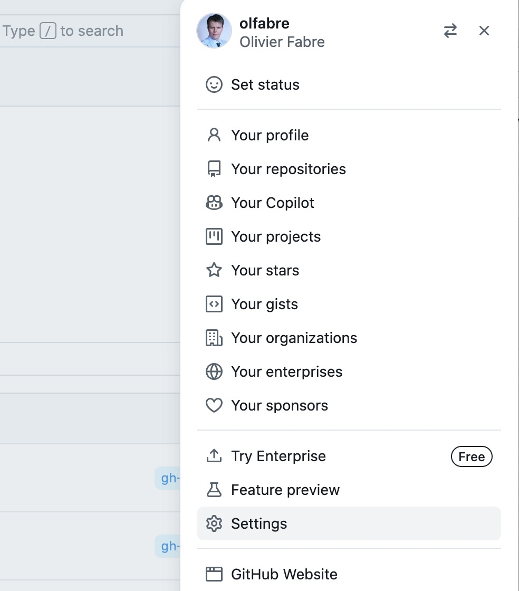


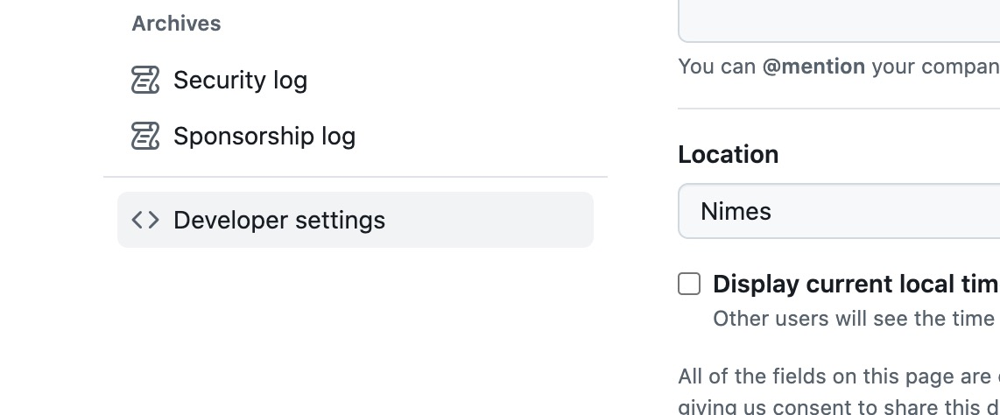


Créer un token illimité avec tous les droits.
Copier le token généré
Aller dans CircleCI, dans 

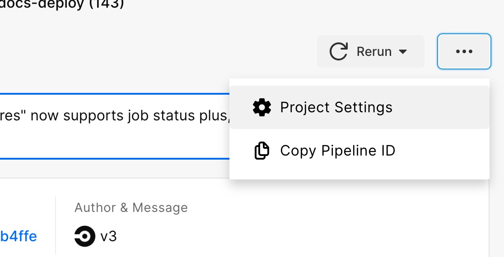

dans le Project Settings du pipeline

ensuite, on doit créer une variable d'environnement en lui donnant un nom et en copiant le token généré par github

ici, c'est TOKEN_JAVADOC

On revient sur la config de CircleCI

```xml
# Use the latest 2.1 version of CircleCI pipeline process engine.
# See: https://circleci.com/docs/configuration-reference
version: 2.1

# Import the Codecov orb
orbs:
  codecov: codecov/codecov@4.0.1

# Define a job to be invoked later in a workflow.
jobs:
  build-and-test:
    docker:
      - image: cimg/openjdk:21.0
    steps:
      # Checkout the code as the first step.
      - checkout

      # Build the project
      - run:
          name: Build
          command: mvn -B -DskipTests clean package

      # Run tests
      - run:
          name: Test
          command: mvn test

      # Generate the JaCoCo report
      - run:
          name: Generate Code Coverage Report
          command: mvn jacoco:report

      # Add Checkstyle verification
      - run:
          name: Run Checkstyle Verification
          command: mvn checkstyle:check

      # Generate Checkstyle HTML report
      - run:
          name: Generate Checkstyle HTML Report
          command: mvn checkstyle:checkstyle

      # Upload the coverage report to Codecov
      - run:
          name: Upload to Codecov
          command: bash <(curl -s https://codecov.io/bash) -t $CODECOV_TOKEN -s target/site/jacoco -r "olfabre/ceri-m1-techniques-de-test"

  docs-deploy:
    docker:
      - image: cimg/openjdk:20.0
    steps:
      - checkout

      - run:
          name: Generate Javadoc
          command: |
            mvn javadoc:javadoc


      - run:
          name: Install and configure gh-pages
          command: |
            git config --global user.email "olfabre@gmail.com"
            git config --global user.name "olfabre"

            # Clone le dépôt
            git clone https://$TOKEN_JAVADOC@github.com/olfabre/ceri-m1-techniques-de-test.git gh-pages
            cd gh-pages

            # Basculer ou créer la branche gh-pages
            git checkout gh-pages || git checkout -b gh-pages

            # Mettre à jour la branche gh-pages avec les changements distants
            git pull origin gh-pages --rebase || echo "No remote changes to pull"

            # Copier les fichiers Javadoc
            cp -r target/site/apidocs/* ./

            # Ajouter, committer et pousser les changements
            git add -A
            git commit -m "[skip ci] Updated Javadoc" || echo "No changes to commit"
            git push https://$TOKEN_JAVADOC@github.com/olfabre/ceri-m1-techniques-de-test.git gh-pages --force

# Orchestrate jobs using workflows
# See: https://circleci.com/docs/workflows/ & https://circleci.com/docs/configuration-reference/#workflows
workflows:
  version: 2
  sample-workflow: # This is the name of the workflow, feel free to change it to better match your workflow.
    when:
      branch: master
    jobs:
      - build-and-test:
          filters:
            branches:
              only:
                - master
      - docs-deploy:
          requires:
            - build-and-test
          filters:
            branches:
              only:
                - master

```

bien mettre les éléments de connexion sur github

git config --global user.email "olfabre@gmail.com"
git config --global user.name "olfabre

Ensuite créer une branche `gh-pages`

Lancer un commit et regarder sur CircileCI

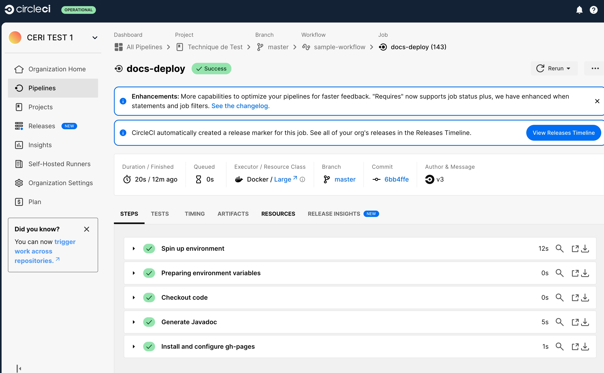

Aller dans /pages sur github

le lien est affiché Your site is live at https://olfabre.github.io/ceri-m1-techniques-de-test/

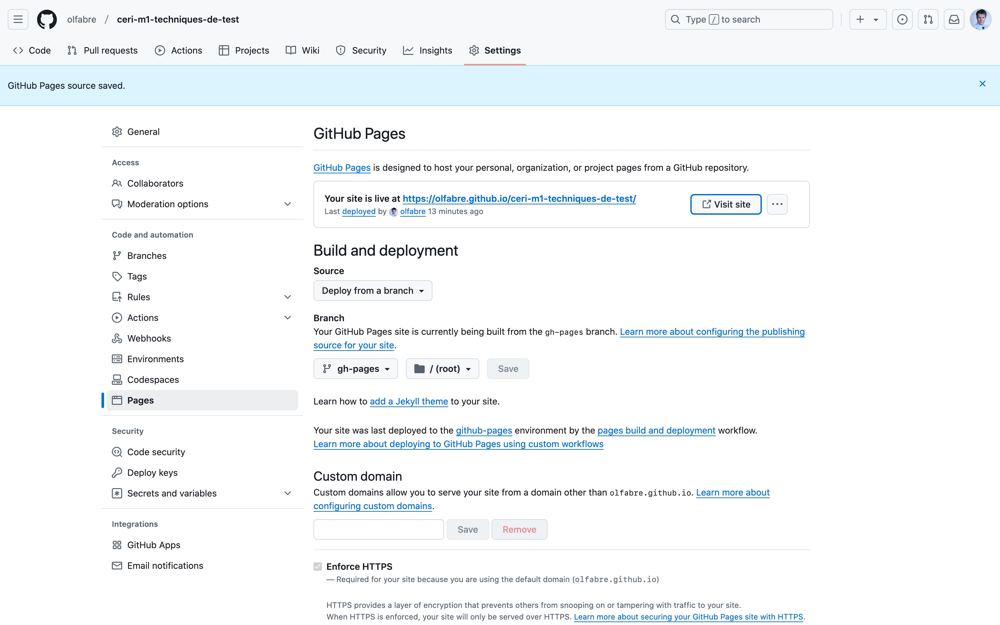


On affiche la page de java doc 

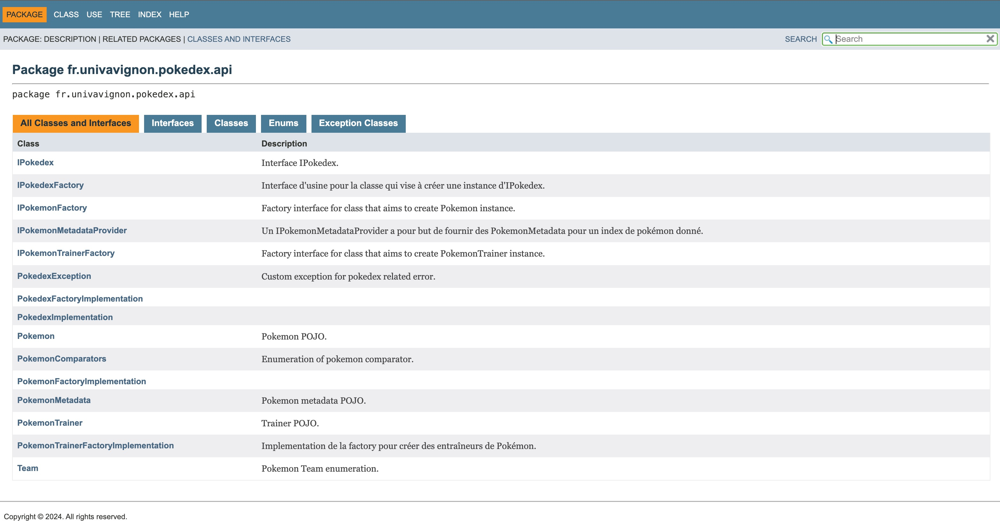


