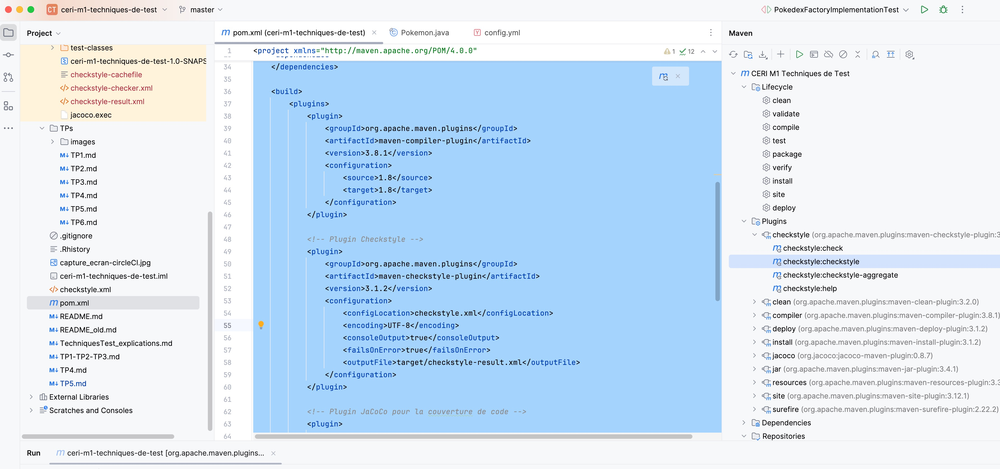
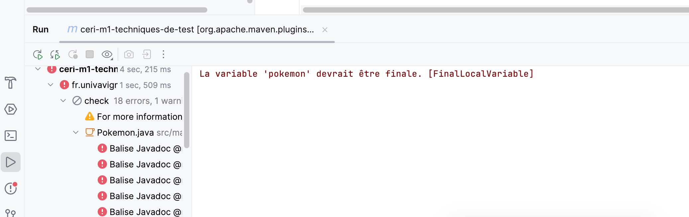
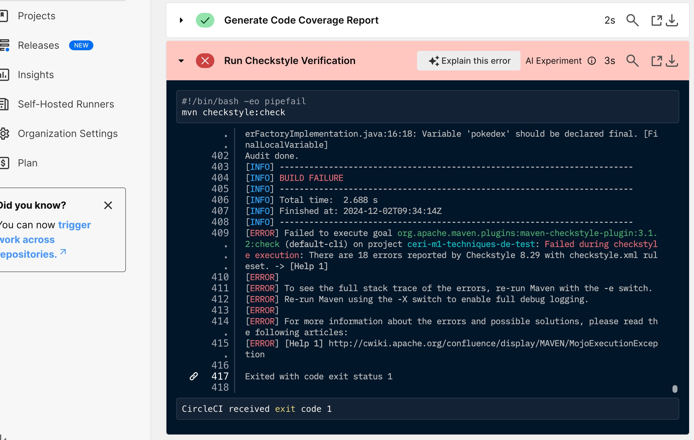
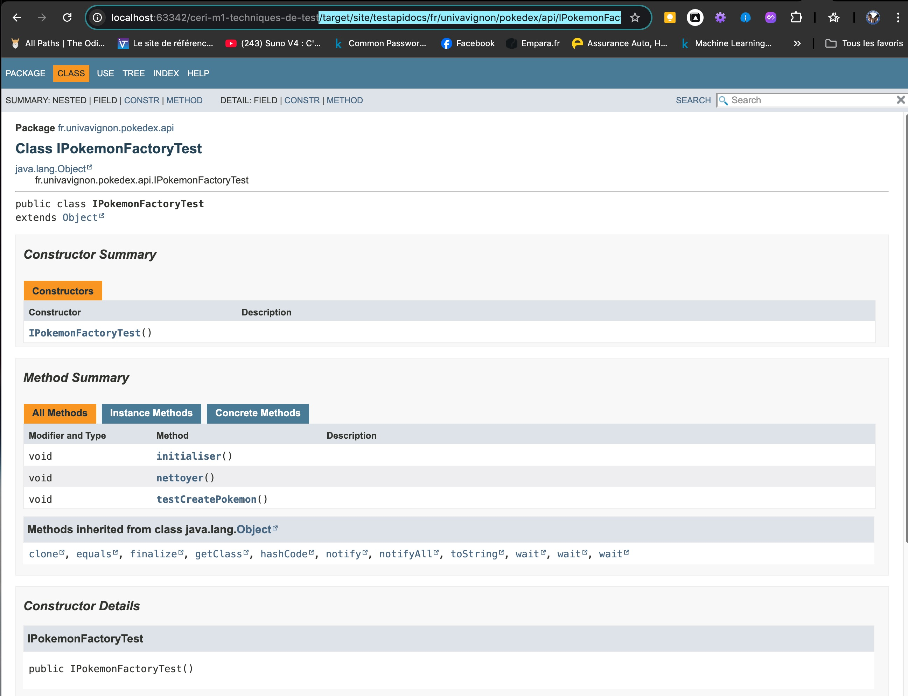
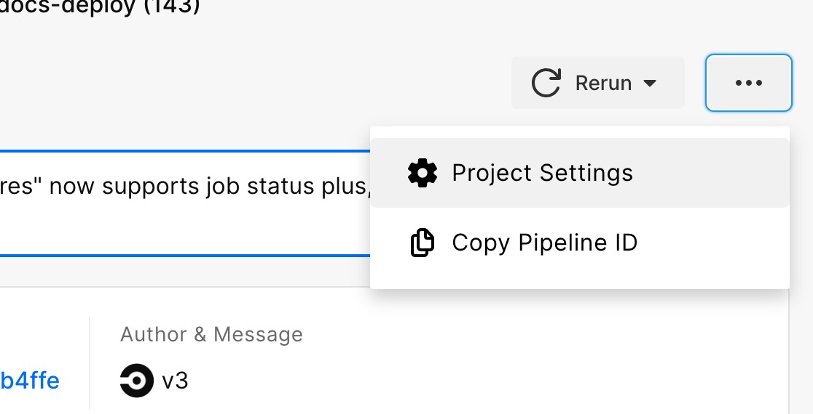
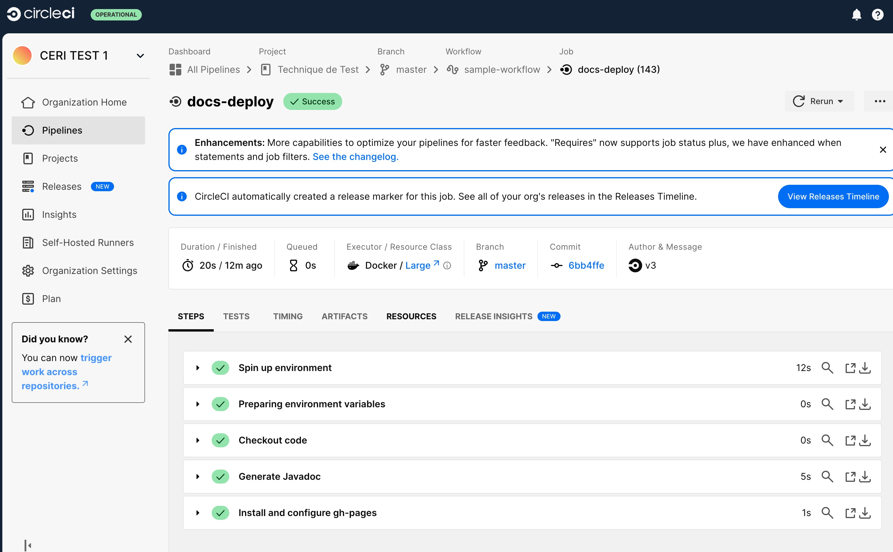
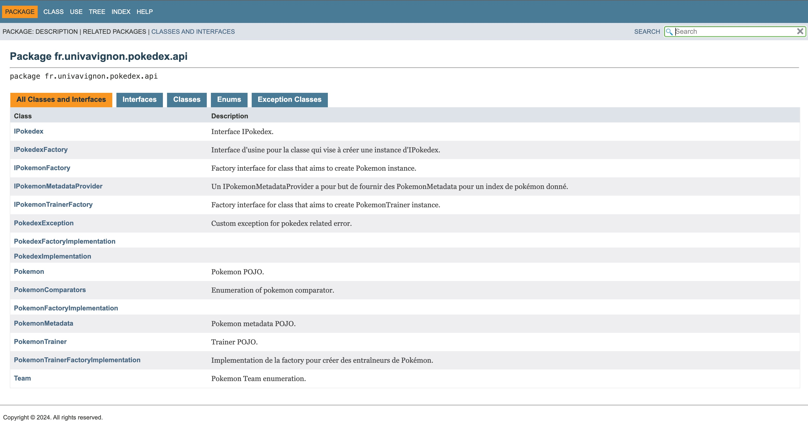

# TP5 Bulbapedia


## Épisode 1

Nous allons intégrer l'outil checkstyle dans notre processus afin de nous assurer que notre code respecte un ensemble de critères de qualité. Nous allons intégrer Checkstyle et l'utiliser avec CircleCI.

On pensera également à intégrer le badge dans le fichier README.md présentant une versions condensée des conclusions du rapport généré.


Etape 1:

Nous allons ajouter le plugin Checkstyle au fichier `pom.xml`

Modifiez la section `<plugins>` dans le fichier `pom.xml` pour inclure le plugin

```xml
<project xmlns="http://maven.apache.org/POM/4.0.0"
         xmlns:xsi="http://www.w3.org/2001/XMLSchema-instance"
         xsi:schemaLocation="http://maven.apache.org/POM/4.0.0 http://maven.apache.org/xsd/maven-4.0.0.xsd">
    <modelVersion>4.0.0</modelVersion>

    <groupId>fr.univavignon</groupId>
    <artifactId>ceri-m1-techniques-de-test</artifactId>
    <version>1.0-SNAPSHOT</version>
    <name>CERI M1 Techniques de Test</name>
    <description>Projet pour l'apprentissage des techniques de test d'API.</description>

    <properties>
        <maven.compiler.source>1.8</maven.compiler.source>
        <maven.compiler.target>1.8</maven.compiler.target>
        <project.build.sourceEncoding>UTF-8</project.build.sourceEncoding> <!-- Encodage par défaut -->
    </properties>

    <dependencies>
        <!-- Dépendance pour JUnit -->
        <dependency>
            <groupId>junit</groupId>
            <artifactId>junit</artifactId>
            <version>4.13.2</version>
            <scope>test</scope>
        </dependency>

        <!-- Dépendance pour Mockito -->
        <dependency>
            <groupId>org.mockito</groupId>
            <artifactId>mockito-core</artifactId>
            <version>3.12.4</version>
            <scope>test</scope>
        </dependency>
    </dependencies>

    <build>
        <plugins>
            <plugin>
                <groupId>org.apache.maven.plugins</groupId>
                <artifactId>maven-compiler-plugin</artifactId>
                <version>3.8.1</version>
                <configuration>
                    <source>1.8</source>
                    <target>1.8</target>
                </configuration>
            </plugin>

            <!-- Plugin Checkstyle -->
            <plugin>
                <groupId>org.apache.maven.plugins</groupId>
                <artifactId>maven-checkstyle-plugin</artifactId>
                <version>3.2.0</version>
                <configuration>
                    <configLocation>checkstyle.xml</configLocation>
                    <encoding>UTF-8</encoding>
                    <consoleOutput>true</consoleOutput>
                    <failsOnError>true</failsOnError>
                    <outputFile>target/checkstyle-result.xml</outputFile>
                </configuration>
            </plugin>

            <!-- Plugin JaCoCo pour la couverture de code -->
            <plugin>
                <groupId>org.jacoco</groupId>
                <artifactId>jacoco-maven-plugin</artifactId>
                <version>0.8.7</version> <!-- Utilisez la dernière version disponible -->
                <executions>
                    <execution>
                        <goals>
                            <goal>prepare-agent</goal>
                        </goals>
                    </execution>
                    <execution>
                        <id>report</id>
                        <phase>test</phase>
                        <goals>
                            <goal>report</goal>
                        </goals>
                    </execution>
                </executions>
            </plugin>
            <plugin>
                <groupId>org.apache.maven.plugins</groupId>
                <artifactId>maven-surefire-plugin</artifactId>
                <version>2.22.2</version>
            </plugin>
        </plugins>
        <sourceDirectory>src/main/java</sourceDirectory>
        <testSourceDirectory>src/test/java</testSourceDirectory>
    </build>
</project>
```


**`configLocation`** : Spécifie le fichier de configuration Checkstyle. Placez un fichier nommé `checkstyle.xml` dans le dossier `src/main/resources` ou à la racine du projet.

**`failsOnError`** : Provoque une erreur si Checkstyle trouve des violations


Etape 2:

Nous allons créer un fichier  `checkstyle.xml` pour définir les règles de style de code.

```xml
<!DOCTYPE module PUBLIC
        "-//Puppy Crawl//DTD Check Configuration 1.3//EN"
        "https://checkstyle.org/dtds/configuration_1_3.dtd">

<module name="Checker">
    <module name="TreeWalker">
        <module name="JavadocMethod">
            <property name="scope" value="public"/>
        </module>
        <module name="WhitespaceAround"/>
        <module name="AvoidStarImport"/>
        <module name="FinalLocalVariable"/>
    </module>
</module>

```

on place ce fichier au même niveau que pom.xml


Etape 3:

Nous allons ajouter Checkstyle à CircleCI

Pour cela, nous allons modifier notre fichier `.circleci/config.yml` pour exécuter Checkstyle pendant la pipeline.

```xml
# Use the latest 2.1 version of CircleCI pipeline process engine.
# See: https://circleci.com/docs/configuration-reference
version: 2.1

# Import the Codecov orb
orbs:
  codecov: codecov/codecov@4.0.1

# Define a job to be invoked later in a workflow.
jobs:
  build-and-test:
    docker:
      - image: cimg/openjdk:21.0
    steps:
      # Checkout the code as the first step.
      - checkout

      # Build the project
      - run:
          name: Build
          command: mvn -B -DskipTests clean package

      # Run tests
      - run:
          name: Test
          command: mvn test

      # Generate the JaCoCo report
      - run:
          name: Generate Code Coverage Report
          command: mvn jacoco:report

      # Add Checkstyle verification
      - run:
          name: Run Checkstyle Verification
          command: mvn checkstyle:check

      # Generate Checkstyle HTML report
      - run:
          name: Generate Checkstyle HTML Report
          command: mvn checkstyle:checkstyle

      # Upload the coverage report to Codecov
      - run:
          name: Upload to Codecov
          command: bash <(curl -s https://codecov.io/bash) -t $CODECOV_TOKEN -s target/site/jacoco -r "olfabre/ceri-m1-techniques-de-test"

workflows:
  sample:
    jobs:
      - build-and-test:
          filters:
            branches:
              only:
                - master

```

Une étape `Generate Checkstyle HTML Report` exécute `mvn checkstyle:checkstyle` pour produire un rapport HTML de Checkstyle.

### Vérification

- Lorsque CircleCI exécute la pipeline, les étapes Checkstyle arrêteront la construction si des violations sont trouvées (grâce à `failsOnError` dans le `pom.xml`).
- Vous pouvez examiner les rapports générés dans `target/site/checkstyle.html` ou dans la console.




Pour vérifier le checkstyle on doit cliquer dans maven / plugins / checkstyle:checkstyle

Nous pouvons aussi corriger le code  




les erreurs checkstyle sont aussi notifiées sur CircleCI




Nous pouvons ajoutés des verifications supplémentaires

```bash
<?xml version="1.0"?>
<!DOCTYPE module PUBLIC
        "-//Checkstyle//DTD Checkstyle Configuration 1.3//EN"
        "https://checkstyle.org/dtds/configuration_1_3.dtd">

<module name="Checker">
    <module name="FileTabCharacter"/>

    <module name="FileLength">
        <property name="max" value="500"/>
    </module>

    <module name="LineLength">
        <property name="max" value="120"/>
    </module>

    <module name="TreeWalker">
        <module name="ConstantName"/>
        <module name="LocalVariableName"/>
        <module name="MemberName"/>
        <module name="MethodName"/>
        <module name="PackageName"/>
        <module name="ParameterName"/>
        <module name="StaticVariableName"/>
        <module name="TypeName"/>

        <module name="AvoidStarImport"/>
        <module name="IllegalImport"/>
        <module name="RedundantImport"/>
        <module name="UnusedImports"/>

        <module name="CyclomaticComplexity">
            <property name="max" value="20"/>
        </module>
        <module name="NPathComplexity">
            <property name="max" value="300"/>
        </module>

        <module name="MethodLength">
            <property name="max" value="100"/>
        </module>
        <module name="EmptyBlock"/>
        <module name="NeedBraces"/>

        <module name="JavadocMethod">
        </module>
        <module name="JavadocType"/>
        <module name="JavadocVariable"/>
    </module>
</module>
```


Voici une explication des vérifications et modules présents dans votre fichier `checkstyle.xml` :

### 1. **FileTabCharacter**

- **Vérification** : Ce module vérifie la présence de tabulations (`\t`) dans le fichier source. Il recommande généralement l'utilisation d'espaces au lieu de tabulations pour l'indentation.
- **But** : Assurer que les fichiers n'utilisent pas de tabulations, ce qui peut entraîner des problèmes de lisibilité dans différents éditeurs.

### 2. **FileLength**

- **Vérification** : Ce module vérifie la longueur des fichiers source. La propriété `max` spécifie la longueur maximale autorisée pour un fichier (ici, 500 lignes).
- **But** : Assurer que les fichiers ne sont pas trop longs, ce qui peut rendre le code difficile à maintenir et à lire.

### 3. **LineLength**

- **Vérification** : Ce module vérifie la longueur des lignes de code. La propriété `max` fixe la longueur maximale autorisée (ici, 120 caractères).
- **But** : Assurer que les lignes ne sont pas trop longues, ce qui rendrait le code difficile à lire, notamment sur des écrans plus petits ou dans des revues de code.

### 4. **TreeWalker**

Le module `TreeWalker` est un "module parent" qui contient plusieurs autres modules de vérification. Il permet de vérifier différentes règles sur les éléments du code.

#### Sous-modules sous `TreeWalker` :

- **ConstantName**
  - **Vérification** : Ce module vérifie que les noms des constantes respectent une convention de nommage (par exemple, tout en majuscules avec des underscores pour séparer les mots).
  - **But** : Assurer que les constantes suivent une convention de nommage standardisée.
- **LocalVariableName**
  - **Vérification** : Ce module vérifie que les noms des variables locales respectent une convention (par exemple, en camelCase).
  - **But** : Assurer que les variables locales sont nommées de manière lisible et cohérente.
- **MemberName**
  - **Vérification** : Ce module vérifie que les noms des membres (champs ou propriétés de classe) respectent une convention (souvent camelCase pour les variables d'instance).
  - **But** : Assurer que les membres sont nommés de manière claire et uniforme.
- **MethodName**
  - **Vérification** : Ce module vérifie que les noms des méthodes respectent une convention de nommage, souvent en camelCase.
  - **But** : Assurer que les méthodes sont nommées de manière claire et lisible.
- **PackageName**
  - **Vérification** : Ce module vérifie que les noms des packages respectent une convention, souvent en minuscules et en suivant une structure de domaine inversé (par exemple, `com.example.project`).
  - **But** : Assurer que les packages sont organisés de manière logique et uniforme.
- **ParameterName**
  - **Vérification** : Ce module vérifie que les noms des paramètres de méthode respectent une convention (par exemple, camelCase).
  - **But** : Assurer que les paramètres sont nommés de manière claire et cohérente.
- **StaticVariableName**
  - **Vérification** : Ce module vérifie que les noms des variables statiques respectent une convention de nommage spécifique (par exemple, en majuscules avec des underscores).
  - **But** : Assurer que les variables statiques sont nommées de manière cohérente et facilement reconnaissable.
- **TypeName**
  - **Vérification** : Ce module vérifie que les noms des types (classes, interfaces, etc.) respectent une convention de nommage (souvent en PascalCase).
  - **But** : Assurer que les types sont nommés de manière lisible et cohérente.
- **AvoidStarImport**
  - **Vérification** : Ce module vérifie que l'importation d'un package avec `*` (importation générique) est évitée. Il préfère les importations explicites.
  - **But** : Assurer que le code ne dépend pas d'importations génériques, ce qui peut rendre le code plus lisible et éviter les conflits de noms.
- **IllegalImport**
  - **Vérification** : Ce module vérifie qu'aucune importation illégale n'est présente dans le code (par exemple, des importations de classes spécifiques interdites par des règles de sécurité ou de conception).
  - **But** : Assurer que seules les importations autorisées sont présentes dans le code.
- **RedundantImport**
  - **Vérification** : Ce module vérifie qu'il n'y a pas d'importations redondantes (par exemple, importer une classe ou un package qui n'est pas utilisé).
  - **But** : Assurer qu'il n'y a pas d'importations inutiles, ce qui rend le code plus propre et plus performant.
- **UnusedImports**
  - **Vérification** : Ce module vérifie qu'il n'y a pas d'importations inutilisées dans le fichier source.
  - **But** : Assurer que le code ne contient pas d'importations inutiles, ce qui réduit la taille du code et améliore la lisibilité.

#### Vérifications sur la complexité du code :

- **CyclomaticComplexity**
  - **Vérification** : Ce module vérifie la complexité cyclomatique du code, qui mesure la complexité d'un programme en fonction du nombre de chemins indépendants dans son flux de contrôle. La propriété `max` définit la complexité maximale autorisée pour une méthode (ici, 20).
  - **But** : Assurer que le code reste compréhensible en limitant la complexité des méthodes.
- **NPathComplexity**
  - **Vérification** : Ce module vérifie la complexité de chemin NPath, qui est une mesure de la complexité d'une méthode basée sur le nombre de chemins d'exécution possibles. La propriété `max` définit la complexité maximale autorisée (ici, 300).
  - **But** : Limiter la complexité des méthodes pour rendre le code plus facile à tester et à maintenir.

#### Vérifications sur la longueur des méthodes et des blocs :

- **MethodLength**
  - **Vérification** : Ce module vérifie que la longueur des méthodes ne dépasse pas une certaine limite, définie par la propriété `max` (ici, 100 lignes).
  - **But** : Assurer que les méthodes ne deviennent pas trop longues et restent compréhensibles.
- **EmptyBlock**
  - **Vérification** : Ce module vérifie qu'il n'y a pas de blocs de code vides dans le code source (par exemple, des blocs de `if` ou de `while` sans instructions).
  - **But** : Éviter les blocs vides, qui peuvent être source d'erreurs ou de code inutilisé.
- **NeedBraces**
  - **Vérification** : Ce module vérifie que les blocs de code associés aux structures de contrôle (`if`, `for`, `while`, etc.) utilisent des accolades, même si une seule ligne est présente.
  - **But** : Assurer que le code est toujours clairement délimité, ce qui évite des erreurs lorsqu'une ligne est ajoutée ou modifiée dans le bloc.

#### Vérifications de la documentation (Javadoc) :

- **JavadocMethod**
  - **Vérification** : Ce module vérifie que les méthodes sont correctement documentées avec des commentaires Javadoc.
  - **But** : Assurer que chaque méthode est bien documentée pour clarifier son fonctionnement.
- **JavadocType**
  - **Vérification** : Ce module vérifie que les types (classes, interfaces, etc.) sont correctement documentés avec des commentaires Javadoc.
  - **But** : Assurer que chaque type est bien documenté pour décrire son rôle dans le projet.
- **JavadocVariable**
  - **Vérification** : Ce module vérifie que les variables de classe et d'instance sont correctement documentées avec des commentaires Javadoc.
  - **But** : Assurer que chaque variable importante est documentée de manière à comprendre son rôle.


Pour permettre la visualisation du badge, nous modifions le code `pom.xml`

```xml
<project xmlns="http://maven.apache.org/POM/4.0.0"
         xmlns:xsi="http://www.w3.org/2001/XMLSchema-instance"
         xsi:schemaLocation="http://maven.apache.org/POM/4.0.0 http://maven.apache.org/xsd/maven-4.0.0.xsd">
    <modelVersion>4.0.0</modelVersion>

    <groupId>fr.univavignon</groupId>
    <artifactId>ceri-m1-techniques-de-test</artifactId>
    <version>1.0-SNAPSHOT</version>
    <name>CERI M1 Techniques de Test</name>
    <description>Projet pour l'apprentissage des techniques de test d'API.</description>

    <properties>
        <maven.compiler.source>1.8</maven.compiler.source>
        <maven.compiler.target>1.8</maven.compiler.target>
        <project.build.sourceEncoding>UTF-8</project.build.sourceEncoding> <!-- Encodage par défaut -->
    </properties>

    <dependencies>
        <!-- Dépendance pour JUnit -->
        <dependency>
            <groupId>junit</groupId>
            <artifactId>junit</artifactId>
            <version>4.13.2</version>
            <scope>test</scope>
        </dependency>

        <!-- Dépendance pour Mockito -->
        <dependency>
            <groupId>org.mockito</groupId>
            <artifactId>mockito-core</artifactId>
            <version>3.12.4</version>
            <scope>test</scope>
        </dependency>
    </dependencies>

    <build>
        <plugins>
            <plugin>
                <groupId>org.apache.maven.plugins</groupId>
                <artifactId>maven-compiler-plugin</artifactId>
                <version>3.8.1</version>
                <configuration>
                    <source>1.8</source>
                    <target>1.8</target>
                </configuration>
            </plugin>

            <!-- Plugin Checkstyle -->
            <plugin>
                <groupId>org.apache.maven.plugins</groupId>
                <artifactId>maven-checkstyle-plugin</artifactId>
                <version>3.2.0</version>
                <configuration>
                    <configLocation>checkstyle.xml</configLocation>

                    <consoleOutput>true</consoleOutput>
                    <failsOnError>true</failsOnError>
                    <outputFile>target/checkstyle-result.xml</outputFile>
                </configuration>
            </plugin>
            <plugin>
                <groupId>com.github.bordertech.buildtools</groupId>
                <artifactId>badger</artifactId>
                <version>1.0.0</version>
                <executions>
                    <execution>
                        <id>verify</id>
                        <phase>verify</phase>
                        <goals>
                            <goal>badges</goal>
                        </goals>
                        <configuration>
                            <outputDir>${project.build.directory}/badges</outputDir>
                            <inputFiles>
                                <inputFile>target/checkstyle-result.xml</inputFile>
                            </inputFiles>
                        </configuration>
                    </execution>
                </executions>
            </plugin>
            <!-- Plugin JaCoCo pour la couverture de code -->
            <plugin>
                <groupId>org.jacoco</groupId>
                <artifactId>jacoco-maven-plugin</artifactId>
                <version>0.8.7</version> <!-- Utilisez la dernière version disponible -->
                <executions>
                    <execution>
                        <goals>
                            <goal>prepare-agent</goal>
                        </goals>
                    </execution>
                    <execution>
                        <id>report</id>
                        <phase>test</phase>
                        <goals>
                            <goal>report</goal>
                        </goals>
                    </execution>
                </executions>
            </plugin>
            <plugin>
                <groupId>org.apache.maven.plugins</groupId>
                <artifactId>maven-surefire-plugin</artifactId>
                <version>2.22.2</version>
            </plugin>
        </plugins>
        <sourceDirectory>src/main/java</sourceDirectory>
        <testSourceDirectory>src/test/java</testSourceDirectory>
    </build>
</project>

```


Cette configuration du plugin **Badger** dans votre `pom.xml` est bien structurée et permet d'éviter l'avertissement lié au répertoire de sortie manquant. Voici une explication détaillée de chaque partie de ce bloc et des actions qu'il effectue :

------

### **1. Structure et Rôle**

```
xml


Copier le code
<plugin>
    <groupId>com.github.bordertech.buildtools</groupId>
    <artifactId>badger</artifactId>
    <version>1.0.0</version>
```

- **groupId** et **artifactId** : Identifient le plugin Maven spécifique (ici, Badger).
- **version** : Spécifie la version utilisée.

------

### **2. Configuration des exécutions**

```
xml


Copier le code
<executions>
    <execution>
        <id>verify</id>
        <phase>verify</phase>
        <goals>
            <goal>badges</goal>
        </goals>
```

- **id** : Nom unique pour cette exécution. Ici, `verify`.
- **phase** : Phase Maven où ce plugin est exécuté. Ici, `verify`, ce qui signifie qu'il s'exécute après les tests et vérifications (comme Checkstyle).
- **goals** : Action spécifique réalisée par le plugin. Ici, la génération de badges avec `badges`.

------

### **3. Configuration du plugin**

```
xml


Copier le code
<configuration>
    <outputDir>${project.build.directory}/badges</outputDir>
    <inputFiles>
        <inputFile>target/checkstyle-result.xml</inputFile>
    </inputFiles>
</configuration>
```

- **outputDir** : Définit où seront placés les badges générés. Ici, dans `target/badges`.
- **inputFiles** : Liste des fichiers d'entrée que Badger transformera en badges. Ici, il s'agit du fichier `checkstyle-result.xml`, généré par Checkstyle.

------

### **4. Vérification et Génération**

Pour tester cette configuration, exécutez la commande suivante dans le répertoire de votre projet Maven :

```
mvn verify
```

- Étapes attendues :
  1. Le plugin Checkstyle génère le fichier `target/checkstyle-result.xml`.
  2. Le plugin Badger transforme ce fichier XML en un badge SVG, stocké dans `target/badges`.


------

### **5. Points à vérifier si l'erreur persiste**

1. **Chemin du fichier Checkstyle**
   - Assurez-vous que le fichier `target/checkstyle-result.xml` est généré avant que Badger ne s'exécute. Si ce fichier manque, Badger échouera.
2. **Répertoire de sortie**
   - Vérifiez que le répertoire `target/badges` est créé automatiquement ou existe déjà. Maven le crée généralement par défaut.
3. **Versions des plugins**
   - Vérifiez que les versions des plugins **Checkstyle** et **Badger** sont compatibles.


**Check style - Verif Style**   
   


## Épisode 2

Un projet n'est rien sans sa documentation, et c'est encore mieux si elle est générée automatiquement ! Nous allons configurer notre intégration continue de manière à ce que la [Javadoc](https://www.oracle.com/java/technologies/javase/javadoc-tool.html) soit générée automatiquement et directement publiée au travers de GitHub Pages.


Pour automatiser la génération et la publication de la Javadoc ainsi que l'intégration des rapports Checkstyle via GitHub Pages, nous pouvons suivre ces étapes :

**Étape 1 : Génération de la Javadoc**

Nous devons modifier `pom.xml`

```xml
<project xmlns="http://maven.apache.org/POM/4.0.0"
         xmlns:xsi="http://www.w3.org/2001/XMLSchema-instance"
         xsi:schemaLocation="http://maven.apache.org/POM/4.0.0 http://maven.apache.org/xsd/maven-4.0.0.xsd">
    <modelVersion>4.0.0</modelVersion>

    <groupId>fr.univavignon</groupId>
    <artifactId>ceri-m1-techniques-de-test</artifactId>
    <version>1.0-SNAPSHOT</version>
    <name>CERI M1 Techniques de Test</name>
    <description>Projet pour l'apprentissage des techniques de test d'API.</description>

    <properties>
        <maven.compiler.source>1.8</maven.compiler.source>
        <maven.compiler.target>1.8</maven.compiler.target>
        <project.build.sourceEncoding>UTF-8</project.build.sourceEncoding> <!-- Encodage par défaut -->
    </properties>

    <dependencies>
        <!-- Dépendance pour JUnit -->
        <dependency>
            <groupId>junit</groupId>
            <artifactId>junit</artifactId>
            <version>4.13.2</version>
            <scope>test</scope>
        </dependency>

        <!-- Dépendance pour Mockito -->
        <dependency>
            <groupId>org.mockito</groupId>
            <artifactId>mockito-core</artifactId>
            <version>3.12.4</version>
            <scope>test</scope>
        </dependency>
    </dependencies>

    <build>
        <plugins>
            <plugin>
                <groupId>org.apache.maven.plugins</groupId>
                <artifactId>maven-compiler-plugin</artifactId>
                <version>3.8.1</version>
                <configuration>
                    <source>1.8</source>
                    <target>1.8</target>
                </configuration>
            </plugin>

            <!-- Plugin Checkstyle -->
            <plugin>
                <groupId>org.apache.maven.plugins</groupId>
                <artifactId>maven-checkstyle-plugin</artifactId>
                <version>3.2.0</version>
                <configuration>
                    <configLocation>checkstyle.xml</configLocation>

                    <consoleOutput>true</consoleOutput>
                    <failsOnError>true</failsOnError>
                    <outputFile>target/checkstyle-result.xml</outputFile>
                </configuration>
            </plugin>
            <plugin>
                <groupId>com.github.bordertech.buildtools</groupId>
                <artifactId>badger</artifactId>
                <version>1.0.0</version>
                <executions>
                    <execution>
                        <id>verify</id>
                        <phase>verify</phase>
                        <goals>
                            <goal>badges</goal>
                        </goals>
                        <configuration>
                            <outputDir>${project.build.directory}/badges</outputDir>
                            <inputFiles>
                                <inputFile>target/checkstyle-result.xml</inputFile>
                            </inputFiles>
                        </configuration>
                    </execution>
                </executions>
            </plugin>
            <!-- Plugin JaCoCo pour la couverture de code -->
            <plugin>
                <groupId>org.jacoco</groupId>
                <artifactId>jacoco-maven-plugin</artifactId>
                <version>0.8.7</version> <!-- Utilisez la dernière version disponible -->
                <executions>
                    <execution>
                        <goals>
                            <goal>prepare-agent</goal>
                        </goals>
                    </execution>
                    <execution>
                        <id>report</id>
                        <phase>test</phase>
                        <goals>
                            <goal>report</goal>
                        </goals>
                    </execution>
                </executions>
            </plugin>
            <plugin>
                <groupId>org.apache.maven.plugins</groupId>
                <artifactId>maven-surefire-plugin</artifactId>
                <version>2.22.2</version>
            </plugin>
            <plugin>
                <groupId>org.apache.maven.plugins</groupId>
                <artifactId>maven-javadoc-plugin</artifactId>
                <version>3.4.0</version>
                <executions>
                    <execution>
                        <id>generate-javadoc</id>
                        <goals>
                            <goal>javadoc</goal>
                        </goals>
                        <phase>verify</phase>
                        <configuration>
                            <reportOutputDirectory>${project.build.directory}/site/apidocs</reportOutputDirectory>
                        </configuration>
                    </execution>
                </executions>
            </plugin>
        </plugins>
        <sourceDirectory>src/main/java</sourceDirectory>
        <testSourceDirectory>src/test/java</testSourceDirectory>
    </build>
</project>

```

Cette configuration génère la Javadoc et la place dans le répertoire `target/site/apidocs`.





**Étape 2 : Vérification de la couverture de la Javadoc**

Nius allons vérifier la configuration au plugin Checkstyle pour vérifier la couverture de votre Javadoc.


```xml
<module name="JavadocMethod">
    <property name="scope" value="public"/>
    <property name="allowMissingParamTags" value="false"/>
    <property name="allowMissingThrowsTags" value="false"/>
</module>
```


**Étape 3 : Configuration CircleCI pour générer et déployer la Javadoc**

Ajoutez une configuration CircleCI pour générer la Javadoc, valider la qualité avec Checkstyle et publier la documentation.

Nous allons modifier le fichier ` .circleci/config.yml`

mais avant, nous devons créer un token sur github


Créer un token illimité avec tous les droits.
Copier le token généré
Aller dans CircleCI, dans 



dans le Project Settings du pipeline

ensuite, on doit créer une variable d'environnement en lui donnant un nom et en copiant le token généré par github

ici, c'est TOKEN_JAVADOC

On revient sur la config de CircleCI

```xml
# Use the latest 2.1 version of CircleCI pipeline process engine.
# See: https://circleci.com/docs/configuration-reference
version: 2.1

# Import the Codecov orb
orbs:
  codecov: codecov/codecov@4.0.1

# Define a job to be invoked later in a workflow.
jobs:
  build-and-test:
    docker:
      - image: cimg/openjdk:21.0
    steps:
      # Checkout the code as the first step.
      - checkout

      # Build the project
      - run:
          name: Build
          command: mvn -B -DskipTests clean package

      # Run tests
      - run:
          name: Test
          command: mvn test

      # Generate the JaCoCo report
      - run:
          name: Generate Code Coverage Report
          command: mvn jacoco:report

      # Add Checkstyle verification
      - run:
          name: Run Checkstyle Verification
          command: mvn checkstyle:check

      # Generate Checkstyle HTML report
      - run:
          name: Generate Checkstyle HTML Report
          command: mvn checkstyle:checkstyle

      # Upload the coverage report to Codecov
      - run:
          name: Upload to Codecov
          command: bash <(curl -s https://codecov.io/bash) -t $CODECOV_TOKEN -s target/site/jacoco -r "olfabre/ceri-m1-techniques-de-test"

  docs-deploy:
    docker:
      - image: cimg/openjdk:20.0
    steps:
      - checkout

      - run:
          name: Generate Javadoc
          command: |
            mvn javadoc:javadoc


      - run:
          name: Install and configure gh-pages
          command: |
            git config --global user.email "olfabre@gmail.com"
            git config --global user.name "olfabre"

            git clone https://$TOKEN_JAVADOC@github.com/olfabre/ceri-m1-techniques-de-test.git gh-pages
            cd gh-pages && git checkout -b gh-pages        
            cp -r target/site/apidocs/* ./
            
            git add -A
            git commit -m "[skip ci] Updated Javadoc"
            git push https://$TOKEN_JAVADOC@github.com/olfabre/ceri-m1-techniques-de-test.git gh-pages


# Orchestrate jobs using workflows
# See: https://circleci.com/docs/workflows/ & https://circleci.com/docs/configuration-reference/#workflows
workflows:
  version: 2
  sample-workflow: # This is the name of the workflow, feel free to change it to better match your workflow.
    when:
      branch: master
    jobs:
      - build-and-test:
          filters:
            branches:
              only:
                - master
      - docs-deploy:
          requires:
            - build-and-test
          filters:
            branches:
              only:
                - master

```

bien mettre les éléments de connexion sur github

git config --global user.email "olfabre@gmail.com"
git config --global user.name "olfabre

Ensuite créer une branche `gh-pages`

Lancer un commit et regarder sur CircileCI



Aller dans /pages sur github

le lien est affiché Your site is live at https://olfabre.github.io/ceri-m1-techniques-de-test/


On affiche la page de java doc 




