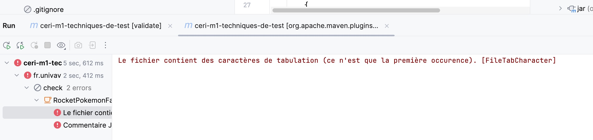
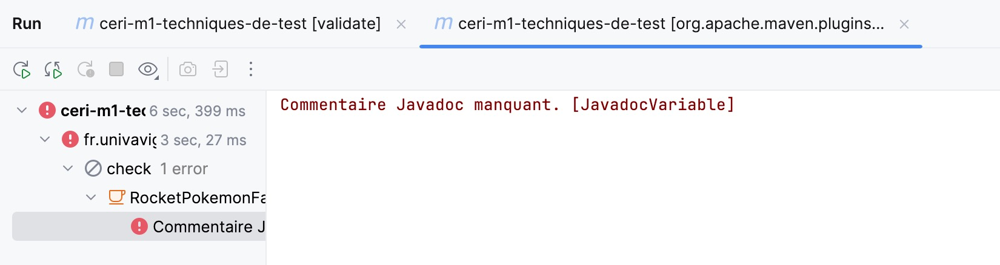
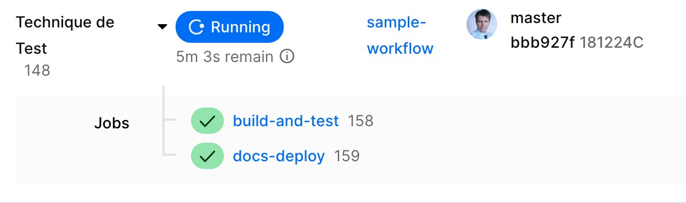
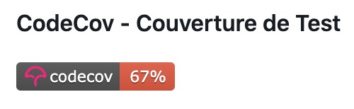
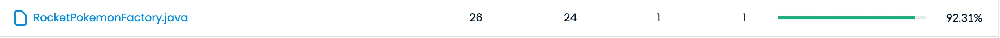
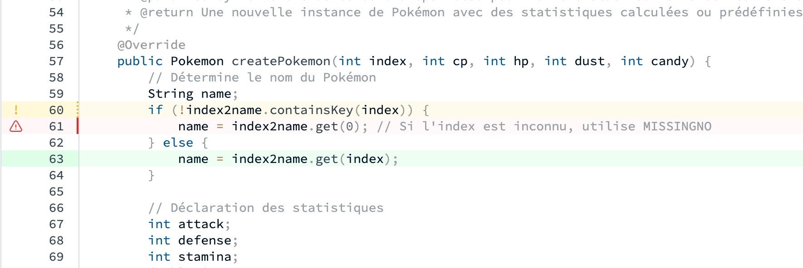
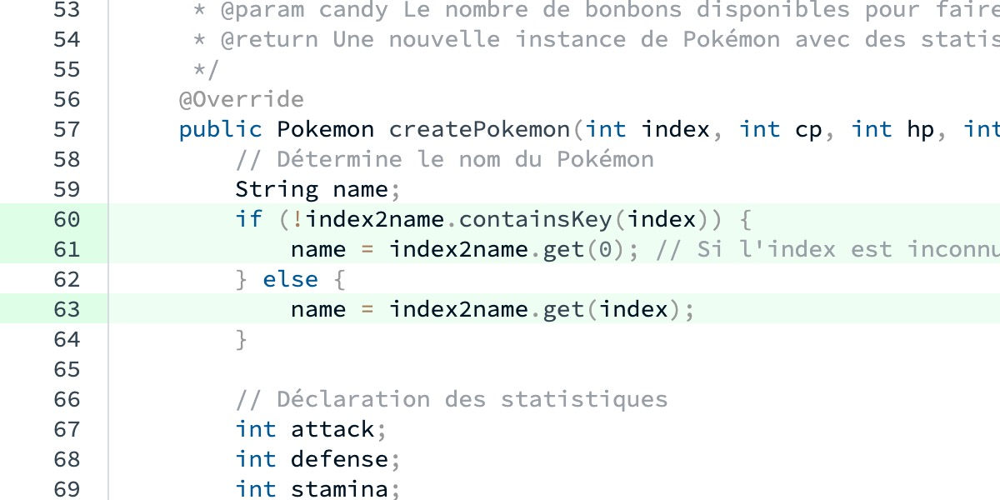
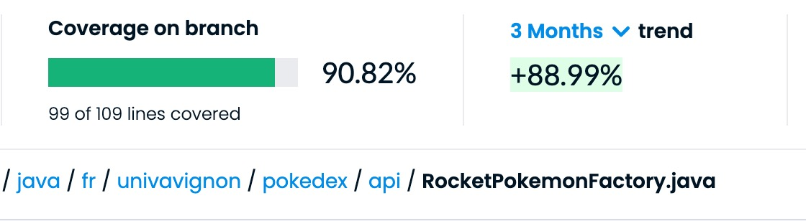
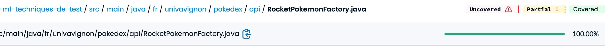

# TP6 : Ils sont de retour pour vous jouer un mauvais tour


## Épisode 1 - Giovanni's touch


Une implémentation de `IPokemonFactory`  a été remise et qui est meilleur que la notre.

On doit intégrer cette implémentation dans notre projet et la passez au crible grâce à notre suite de tests et au travers d'une revue de code, on doit rédigez un succint rapport qui présente nos conclusions. Certains défauts de leur implémentation ne sont peut-être pas couverts par les tests que nous avons déjà mis en place, on ne doit pas hésitez pas à relever ces défauts aussi, et, si nous y parvenons, à mettre en place des tests pour les détecter automatiquement.

**Etape 1: nous intégrons la nouvelle dépendance pour faire fonctionner le code améliorée**

La dépendance **`commons-collections4`** d'Apache est une bibliothèque Java qui fait partie de l'ensemble Apache Commons. Elle fournit des implémentations améliorées et supplémentaires de collections (telles que les listes, les ensembles, les cartes, etc.) qui ne sont pas incluses dans la bibliothèque standard de Java. 
Elle a été intégrée dans `pom.xml`

```xml
<project xmlns="http://maven.apache.org/POM/4.0.0"
         xmlns:xsi="http://www.w3.org/2001/XMLSchema-instance"
         xsi:schemaLocation="http://maven.apache.org/POM/4.0.0 http://maven.apache.org/xsd/maven-4.0.0.xsd">
    <modelVersion>4.0.0</modelVersion>

    <groupId>fr.univavignon</groupId>
    <artifactId>ceri-m1-techniques-de-test</artifactId>
    <version>1.0-SNAPSHOT</version>
    <name>CERI M1 Techniques de Test</name>
    <description>Projet pour l'apprentissage des techniques de test d'API.</description>

    <properties>
        <maven.compiler.source>1.8</maven.compiler.source>
        <maven.compiler.target>1.8</maven.compiler.target>
        <project.build.sourceEncoding>UTF-8</project.build.sourceEncoding> <!-- Encodage par défaut -->
    </properties>

    <dependencies>
        <!-- Dépendance pour JUnit -->
        <dependency>
            <groupId>junit</groupId>
            <artifactId>junit</artifactId>
            <version>4.13.2</version>
            <scope>test</scope>
        </dependency>

        <!-- Dépendance pour Mockito -->
        <dependency>
            <groupId>org.mockito</groupId>
            <artifactId>mockito-core</artifactId>
            <version>3.12.4</version>
            <scope>test</scope>
        </dependency>

        <!-- Dépendance commons-collections4 de Apache en version 4.0 -->
        <dependency>
            <groupId>org.apache.commons</groupId>
            <artifactId>commons-collections4</artifactId>
            <version>4.0</version>
        </dependency>
    </dependencies>

    <build>
        <plugins>
            <plugin>
                <groupId>org.apache.maven.plugins</groupId>
                <artifactId>maven-compiler-plugin</artifactId>
                <version>3.8.1</version>
                <configuration>
                    <source>1.8</source>
                    <target>1.8</target>
                </configuration>
            </plugin>

            <!-- Plugin Checkstyle -->
            <plugin>
                <groupId>org.apache.maven.plugins</groupId>
                <artifactId>maven-checkstyle-plugin</artifactId>
                <version>3.2.0</version>
                <configuration>
                    <configLocation>checkstyle.xml</configLocation>

                    <consoleOutput>true</consoleOutput>
                    <failsOnError>true</failsOnError>
                    <outputFile>target/checkstyle-result.xml</outputFile>
                </configuration>
            </plugin>
            <plugin>
                <groupId>com.github.bordertech.buildtools</groupId>
                <artifactId>badger</artifactId>
                <version>1.0.0</version>
                <executions>
                    <execution>
                        <id>verify</id>
                        <phase>verify</phase>
                        <goals>
                            <goal>badges</goal>
                        </goals>
                        <configuration>
                            <outputDir>${project.build.directory}/badges</outputDir>
                            <inputFiles>
                                <inputFile>target/checkstyle-result.xml</inputFile>
                            </inputFiles>
                        </configuration>
                    </execution>
                </executions>
            </plugin>
            <!-- Plugin JaCoCo pour la couverture de code -->
            <plugin>
                <groupId>org.jacoco</groupId>
                <artifactId>jacoco-maven-plugin</artifactId>
                <version>0.8.7</version> <!-- Utilisez la dernière version disponible -->
                <executions>
                    <execution>
                        <goals>
                            <goal>prepare-agent</goal>
                        </goals>
                    </execution>
                    <execution>
                        <id>report</id>
                        <phase>test</phase>
                        <goals>
                            <goal>report</goal>
                        </goals>
                    </execution>
                </executions>
            </plugin>
            <plugin>
                <groupId>org.apache.maven.plugins</groupId>
                <artifactId>maven-surefire-plugin</artifactId>
                <version>2.22.2</version>
            </plugin>
            <plugin>
                <groupId>org.apache.maven.plugins</groupId>
                <artifactId>maven-javadoc-plugin</artifactId>
                <version>3.4.0</version>
                <executions>
                    <execution>
                        <id>generate-javadoc</id>
                        <goals>
                            <goal>javadoc</goal>
                        </goals>
                        <phase>verify</phase>
                        <configuration>
                            <reportOutputDirectory>${project.build.directory}/site/apidocs</reportOutputDirectory>
                        </configuration>
                    </execution>
                </executions>
            </plugin>
        </plugins>
        <sourceDirectory>src/main/java</sourceDirectory>
        <testSourceDirectory>src/test/java</testSourceDirectory>
    </build>
</project>

```


**Etape 2: nous allons étudier le code améliorée**

```java
package fr.univavignon.pokedex.imp;

import java.util.HashMap;
import java.util.Map;
import java.util.Random;

import org.apache.commons.collections4.map.UnmodifiableMap;

import fr.univavignon.pokedex.api.IPokemonFactory;
import fr.univavignon.pokedex.api.Pokemon;

public class RocketPokemonFactory implements IPokemonFactory {
	
	private static Map<Integer, String> index2name;
	static {
		Map<Integer, String> aMap = new HashMap<Integer, String>();
        aMap.put(-1, "Ash's Pikachu");
        aMap.put(0, "MISSINGNO");
        aMap.put(1, "Bulbasaur");
        //TODO : Gotta map them all !
        index2name = UnmodifiableMap.unmodifiableMap(aMap);
	}
	
	private static int generateRandomStat() {
		int total = 0;
		for(int i=0; i < 1000000; i++)
		{
			Random rn = new Random();
		    int r = rn.nextInt(2);
		    total = total + r;
		}
		return total / 10000;
	}

	@Override
	public Pokemon createPokemon(int index, int cp, int hp, int dust, int candy) {
		String name;
		if(!index2name.containsKey(index)) {
			name = index2name.get(0);
		} else {
			name = index2name.get(index);
		}
		int attack;
		int defense;
		int stamina;
		double iv;
		if(index < 0) {
			attack = 1000;
			defense = 1000;
			stamina = 1000;
			iv = 0;
		} else {
			attack = RocketPokemonFactory.generateRandomStat();
			defense = RocketPokemonFactory.generateRandomStat();
			stamina = RocketPokemonFactory.generateRandomStat();
			iv = 1;
		}
		return new Pokemon(index, name, attack, defense, stamina, cp, hp, dust, candy, iv);
	}

}
```

Explication du code:

```java
import java.util.HashMap;
import java.util.Map;
import java.util.Random;
```

**HashMap** : Permet de stocker des paires clé-valeur, ici pour associer un index à un nom de Pokémon.

**Map** : Interface générale pour manipuler des structures de données sous forme clé-valeur.

**Random** : Générateur de nombres aléatoires, utilisé ici pour générer des statistiques aléatoires.


```java
import org.apache.commons.collections4.map.UnmodifiableMap;
```

Fournit une map qui ne peut pas être modifiée une fois créée. Cela protège les données contre les modifications accidentelles

.

```java
import fr.univavignon.pokedex.api.IPokemonFactory;
import fr.univavignon.pokedex.api.Pokemon;
```

**IPokemonFactory** : Interface que cette classe implémente pour créer des objets Pokémon.

**Pokemon** : Classe représentant un Pokémon avec ses attributs (attaque, défense, nom, etc.).


```java
public class RocketPokemonFactory implements IPokemonFactory {
```

Déclare la classe `RocketPokemonFactory` qui implémente l'interface `IPokemonFactory`. Elle doit fournir une implémentation pour la méthode `createPokemon`.


```java
private static Map<Integer, String> index2name;
```

Map statique pour associer des indices de Pokémon (clés) à leurs noms (valeurs). Elle est partagée entre toutes les instances de la classe.


```java
static {
	Map<Integer, String> aMap = new HashMap<>();
    aMap.put(-1, "Ash's Pikachu"); // Associe l'index -1 au nom "Ash's Pikachu".
    aMap.put(0, "MISSINGNO");      // Associe l'index 0 au nom "MISSINGNO".
    aMap.put(1, "Bulbasaur");      // Associe l'index 1 au nom "Bulbasaur".
    // TODO : Ajouter tous les Pokémon ("Gotta map them all!").
    index2name = UnmodifiableMap.unmodifiableMap(aMap);
}
```


**Etape 3: nous allons jouter le code améliorée**

Nous avons du réaliser des imports de bibliothèques pour l'ajout.

Après un premier checkstyle:check:

- le fichier comporte une redondance d'imports

```java
//import fr.univavignon.pokedex.api.IPokemonFactory;
//import fr.univavignon.pokedex.api.Pokemon;
```

Nous les mettons en commentaire

- le fichier contient des tabulations

  

Nous les supprimons en réindentant les 4 espaces.


- le fichier manque de commentaire JavaDoc

  

Nous lui ajoutons les commentaires au format java doc

```java
package fr.univavignon.pokedex.api;

import java.util.HashMap;
import java.util.Map;
import java.util.Random;

import org.apache.commons.collections4.map.UnmodifiableMap;

/**
 * Une fabrique permettant de créer des instances de Pokémon.
 * Cette fabrique inclut des Pokémon spéciaux tels que le Pikachu de Sacha et MISSINGNO.
 */
public class RocketPokemonFactory implements IPokemonFactory {

    /**
     * Une carte (map) immuable associant les indices des Pokémon à leurs noms.
     * Comprend des entrées spéciales pour les Pokémon manquants et le Pikachu de Sacha.
     */
    private static Map<Integer, String> index2name;

    // Initialisation statique de la carte des noms de Pokémon
    static {
        Map<Integer, String> aMap = new HashMap<>();
        aMap.put(-1, "Ash's Pikachu"); // Le Pikachu de Sacha
        aMap.put(0, "MISSINGNO");      // Pokémon manquant
        aMap.put(1, "Bulbasaur");      // Bulbizarre
        // TODO : Ajouter les autres Pokémon
        index2name = UnmodifiableMap.unmodifiableMap(aMap);
    }

    /**
     * Génère une statistique aléatoire pour un Pokémon en simulant un grand nombre de valeurs aléatoires.
     * 
     * @return La moyenne des valeurs générées.
     */
    private static int generateRandomStat() {
        int total = 0;
        for (int i = 0; i < 1000000; i++) {
            Random rn = new Random();
            int r = rn.nextInt(2);
            total = total + r;
        }
        return total / 10000;
    }

    /**
     * Crée une instance de Pokémon avec les attributs spécifiés.
     *
     * @param index L'indice du Pokémon dans le Pokédex.
     * @param cp La puissance de combat (Combat Power) du Pokémon.
     * @param hp Les points de vie (Hit Points) du Pokémon.
     * @param dust Le coût en poussière d'étoile pour renforcer le Pokémon.
     * @param candy Le nombre de bonbons disponibles pour faire évoluer ou renforcer le Pokémon.
     * @return Une nouvelle instance de Pokémon avec des statistiques calculées ou prédéfinies.
     */
    @Override
    public Pokemon createPokemon(int index, int cp, int hp, int dust, int candy) {
        // Détermine le nom du Pokémon
        String name;
        if (!index2name.containsKey(index)) {
            name = index2name.get(0); // Si l'index est inconnu, utilise MISSINGNO
        } else {
            name = index2name.get(index);
        }

        // Déclaration des statistiques
        int attack;
        int defense;
        int stamina;
        double iv;

        // Cas spécial pour les indices négatifs
        if (index < 0) {
            attack = 1000;
            defense = 1000;
            stamina = 1000;
            iv = 0;
        } else {
            attack = RocketPokemonFactory.generateRandomStat();
            defense = RocketPokemonFactory.generateRandomStat();
            stamina = RocketPokemonFactory.generateRandomStat();
            iv = 1;
        }

        // Retourne une instance de Pokémon
        return new Pokemon(index, name, attack, defense, stamina, cp, hp, dust, candy, iv);
    }
}

```

Tout est maintenant ok.




Couverture de test a maintenant baissé. Nous devons faire les tests unitaires à la nouvelle implémentation à partir de ma classe que j'avais déjà créée pour cette occasion: `PokemonFactoryImplementationTest`




```java
package fr.univavignon.pokedex.api;

import org.junit.Before;
import org.junit.Test;

import static org.junit.Assert.*;

public class PokemonFactoryImplementationTest {

    private IPokemonFactory implementationFactory;
    private IPokemonFactory rocketFactory;

    @Before
    public void setUp() {
        implementationFactory = new PokemonFactoryImplementation();
        rocketFactory = new RocketPokemonFactory();
    }

    private void testCreatePokemon(IPokemonFactory factory) {
        // Création d'un nouveau Pokémon
        Pokemon pokemon = factory.createPokemon(1, 100, 100, 100, 100);

        // Vérification des propriétés du Pokémon
        assertEquals(1, pokemon.getIndex());
        assertNotNull(pokemon.getName());
        assertTrue(pokemon.getAttack() >= 0);
        assertTrue(pokemon.getDefense() >= 0);
        assertTrue(pokemon.getStamina() >= 0);
        assertEquals(100, pokemon.getCp());
        assertEquals(100, pokemon.getHp());
        assertEquals(100, pokemon.getDust());
        assertEquals(100, pokemon.getCandy());
        assertTrue(pokemon.getIv() >= 0.0 && pokemon.getIv() <= 1.0);
    }

    private void testInvalidIndex(IPokemonFactory factory) {
        // Création d'un Pokémon avec un index invalide
        Pokemon pokemon = factory.createPokemon(-1, 100, 100, 100, 100);

        // Vérification des propriétés du Pokémon
        assertEquals(-1, pokemon.getIndex());
        assertNotNull(pokemon.getName());
        if (factory instanceof RocketPokemonFactory) {
            assertEquals("Ash's Pikachu", pokemon.getName());
        }
    }

    private void testInvalidCp(IPokemonFactory factory) {
        // Création d'un Pokémon avec un cp invalide
        Pokemon pokemon = factory.createPokemon(1, -100, 100, 100, 100);

        // Vérification des propriétés du Pokémon
        assertEquals(1, pokemon.getIndex());
        assertEquals(-100, pokemon.getCp());
    }

    @Test
    public void testImplementationFactory() {
        testCreatePokemon(implementationFactory);
        testInvalidIndex(implementationFactory);
        testInvalidCp(implementationFactory);
    }

    @Test
    public void testRocketFactory() {
        testCreatePokemon(rocketFactory);
        testInvalidIndex(rocketFactory);
        testInvalidCp(rocketFactory);
    }
}

```

Mes tests  vérifient le bon fonctionnement des deux implémentations d'une interface `IPokemonFactory`: mon implémentation (`PokemonFactoryImplementation`) et l' implémentation du TP nommée `RocketPokemonFactory`

**`testCreatePokemon`** : vérifie la création de Pokémon avec des données valides.

**`testInvalidIndex`** : vérifie le comportement de la fabrique lorsqu'un index invalide est utilisé.

**`testInvalidCp`** : vérifie le comportement de la fabrique lorsqu'un CP (Combat Power) invalide est fourni.

Chaque méthode est appliquée aux 2 fabriques via mes tests `testImplementationFactory` et `testRocketFactory`.


J'observe que sur Codecov, mes tests n'ont pas couvert la totalité de la classe `RocketPokemonFactory`



Si je regarde en détail, il y a le cas ou l'index est inconnu, on doit utiliser MISSINGNO

Nous allons implémenter le test pour ce cas



Nous allons ajouter ce test

```java
@Test
public void testRocketFactoryAvecIndexInconnu() {
    Pokemon pokemon = rocketFactory.createPokemon(3000, 100, 100, 100, 100);
    assertEquals(3000, pokemon.getIndex());
    assertEquals("MISSINGNO", pokemon.getName());
}
```


Nous vérifions, on a bien couvert ce cas







On n'est pas totalement à 100%
Il manque le cas d'un index négatif (-1 de Pikatchu)

si on regarde le code de la classe `RocketPokemonFactory`

nous avons l'ajout dans la Map, d'un index négatif


On va donc intégrer ce cas dans mes tests


```java
@Test
    public void testRocketFactoryAvecIndexNegatif() {
        Pokemon pokemon = rocketFactory.createPokemon(-1, 100, 100, 100, 100);

        assertEquals(-1, pokemon.getIndex());
        assertEquals("Ash's Pikachu", pokemon.getName());
        assertEquals(1000, pokemon.getAttack());
        assertEquals(1000, pokemon.getDefense());
        assertEquals(1000, pokemon.getStamina());
        assertEquals(0.0, pokemon.getIv(), 0.01);
    }
```




Nous voyons que nous avons couvert la totalité de l'implémentation.

