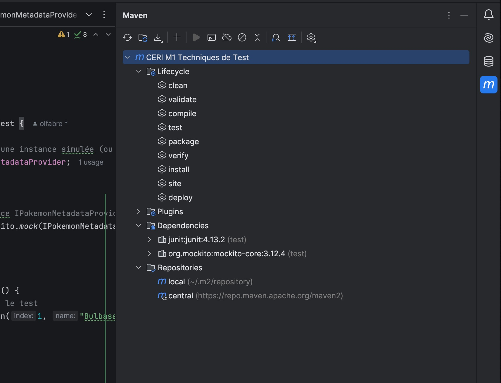

### Mes explication sur le cours des tests

> Le but d'un test est de vérifier qu'une fonctionnalité fait ce que l'on attend d'elle.

#### 1.Le contexte

je programme en java avec la configuration suivante:

```bash
java --version

openjdk 21.0.1 2023-10-17
OpenJDK Runtime Environment (build 21.0.1+12-29)
OpenJDK 64-Bit Server VM (build 21.0.1+12-29, mixed mode, sharing)
```

J'utilise un IDE IntelliJ IDEA

```bash
IntelliJ IDEA 2024.2.3 (Ultimate Edition)
Build #IU-242.23339.11, built on September 25, 2024
Licensed to Olivier Fabre
Subscription is active until April 28, 2025.
For educational use only.
Runtime version: 21.0.4+13-b509.17 x86_64 (JCEF 122.1.9)
VM: OpenJDK 64-Bit Server VM by JetBrains s.r.o.
Toolkit: sun.lwawt.macosx.LWCToolkit
macOS 10.15.7
GC: G1 Young Generation, G1 Concurrent GC, G1 Old Generation
Memory: 2048M
Cores: 8
Metal Rendering is ON
Registry:
  ide.experimental.ui=true
  i18n.locale=
Non-Bundled Plugins:
  com.jetbrains.space (242.23339.11)
  monokai-pro (1.10)
  com.markskelton.one-dark-theme (5.12.0)
  com.jetbrains.packagesearch.intellij-plugin (242.0.12)
Kotlin: 242.23339.11-IJ
```

Je travaille avec Maven qui est un outil de gestion et d'automatisation de projets pour le langage Java:

- Il permet la gestion des dépendances grâvce au fichier pom.xml
- Il impose une structure de projet standard.
- Il définit un cycle de vie de construction avec les phases prédéfinies (compile, test, package, install et deploy). Cela vous permet de gérer facilement le processus de développement et de déploiement d'une application.
- Maven est extensible grâce à des plugins, qui ajoutent des fonctionnalités pour des tâches spécifiques comme la compilation, le test, l'exécution de code statique, et le déploiement.
- Maven s'intègre facilement avec des IDE comme IntelliJ IDEA, Eclipse, et des outils d'intégration continue comme Jenkins, CircleCI, etc.
- Il fournit des fonctionnalités pour générer de la documentation pour un projet, ce qui peut être utile pour maintenir et partager des informations avec d'autres développeurs.

Pour les tests automatiques (intégration continue), j'utilise une application tiers en partie gratuite:

https://app.circleci.com/

qui permets avec son compte GitHub, de créer un pipeline et de réaliser des tests automatique à chaque commit.

Quel est l'intérêt de passer par une application tierce ?

Mon code fonctionne sur ma machine mais qui me dit que ce dernier fonctionne aussi sur d'autres machines? La vérification par un tiers sur un environnement isolé permet de s'assurer avec une forte probabilité que le code fonctionnera ailleurs.

#### Maven et Pom.xml

Pour maven, à la racine j'ai créé le fichier pom.xml pour sa configuration:


```xml
<project xmlns="http://maven.apache.org/POM/4.0.0"
         xmlns:xsi="http://www.w3.org/2001/XMLSchema-instance"
         xsi:schemaLocation="http://maven.apache.org/POM/4.0.0 http://maven.apache.org/xsd/maven-4.0.0.xsd">
    <modelVersion>4.0.0</modelVersion>

    <groupId>fr.univavignon</groupId>
    <artifactId>ceri-m1-techniques-de-test</artifactId>
    <version>1.0-SNAPSHOT</version>
    <name>CERI M1 Techniques de Test</name>
    <description>Projet pour l'apprentissage des techniques de test d'API.</description>

    <properties>
        <maven.compiler.source>1.8</maven.compiler.source>
        <maven.compiler.target>1.8</maven.compiler.target>
        <project.build.sourceEncoding>UTF-8</project.build.sourceEncoding> <!-- Encodage par défaut -->
    </properties>

    <dependencies>
        <!-- Dépendance pour JUnit -->
        <dependency>
            <groupId>junit</groupId>
            <artifactId>junit</artifactId>
            <version>4.13.2</version>
            <scope>test</scope>
        </dependency>

        <!-- Dépendance pour Mockito -->
        <dependency>
            <groupId>org.mockito</groupId>
            <artifactId>mockito-core</artifactId>
            <version>3.12.4</version>
            <scope>test</scope>
        </dependency>
    </dependencies>

    <build>
        <plugins>
            <plugin>
                <groupId>org.apache.maven.plugins</groupId>
                <artifactId>maven-compiler-plugin</artifactId>
                <version>3.8.1</version>
                <configuration>
                    <source>1.8</source>
                    <target>1.8</target>
                </configuration>
            </plugin>
        </plugins>
    </build>
</project>
```


##### > En-tête du fichier et déclaration du projet

```xml
<project xmlns="http://maven.apache.org/POM/4.0.0"
         xmlns:xsi="http://www.w3.org/2001/XMLSchema-instance"
         xsi:schemaLocation="http://maven.apache.org/POM/4.0.0 http://maven.apache.org/xsd/maven-4.0.0.xsd">
```

Cette partie définit le projet Maven et spécifie la version du POM (Project Object Model) à utiliser (`4.0.0`), qui est une spécification de la structure des projets Maven. Les autres attributs XML (comme `xmlns:xsi`) définissent l'espace de noms XML et où se trouve le schéma XML correspondant.

##### > Version du modèle

```xml
<modelVersion>4.0.0</modelVersion>
```

Indique la version du modèle POM. La version `4.0.0` est la version standard utilisée dans Maven.

##### > GroupId, ArtifactId, et Version


```xml
<groupId>fr.univavignon</groupId>
<artifactId>ceri-m1-techniques-de-test</artifactId>
<version>1.0-SNAPSHOT</version>
```

**groupId** : Identifie de manière unique le projet au sein d'une organisation (ici, `fr.univavignon`).

**artifactId** : Nom du projet ou module. Il doit être unique au sein du groupId (ici, `ceri-m1-techniques-de-test`).

**version** : La version du projet. `1.0-SNAPSHOT` indique qu'il s'agit d'une version en développement, non stable. Une version stable serait simplement marquée `1.0`.

##### > Nom et description du projet

```xml
<name>CERI M1 Techniques de Test</name>
<description>Projet pour l'apprentissage des techniques de test d'API.</description>
```

**name** : Nom lisible du projet.

**description** : Brève description du projet.

##### > Propriétés

```xml
<properties>
    <maven.compiler.source>1.8</maven.compiler.source>
    <maven.compiler.target>1.8</maven.compiler.target>
    <project.build.sourceEncoding>UTF-8</project.build.sourceEncoding>
</properties>
```

**maven.compiler.source** et **maven.compiler.target** : Spécifient la version de Java à utiliser pour la compilation du projet (Java 1.8).

**project.build.sourceEncoding** : Définit l'encodage des fichiers sources, ici UTF-8.

##### > Dépendances

```xml
<dependencies>
    <!-- Dépendance pour JUnit -->
    <dependency>
        <groupId>junit</groupId>
        <artifactId>junit</artifactId>
        <version>4.13.2</version>
        <scope>test</scope>
    </dependency>

    <!-- Dépendance pour Mockito -->
    <dependency>
        <groupId>org.mockito</groupId>
        <artifactId>mockito-core</artifactId>
        <version>3.12.4</version>
        <scope>test</scope>
    </dependency>
</dependencies>
```

Les dépendances sont des bibliothèques dont le projet a besoin pour fonctionner. Ici, deux dépendances sont déclarées :

- **JUnit** : Un framework pour les tests unitaires (version 4.13.2), utilisé uniquement dans le cadre des tests (scope `test`). Les classes de Junit 4 sont dans le package org.junit
- **Mockito** : Une bibliothèque pour créer des mocks dans les tests (version 3.12.4), également utilisée dans les tests uniquement. Cela signifie que **Mockito** sera utilisé uniquement lors des phases de test (`scope` = `test`). Cela te permet de **simuler** les composants que tu ne souhaites pas tester directement (comme des services externes ou des bases de données) pour te concentrer sur le comportement de la classe que tu testes.


##### > Build et plugins

```xml
<build>
    <plugins>
        <plugin>
            <groupId>org.apache.maven.plugins</groupId>
            <artifactId>maven-compiler-plugin</artifactId>
            <version>3.8.1</version>
            <configuration>
                <source>1.8</source>
                <target>1.8</target>
            </configuration>
        </plugin>
    </plugins>
</build>
```

**build** : Déclare les instructions de compilation spécifiques au projet.

**plugin maven-compiler-plugin** : Le plugin Maven utilisé pour compiler le code Java. La configuration précise qu'il utilise Java 1.8 (source et target).

Cependant, tu mentionnes que tu as le **JDK 21** installé, ce qui est bien plus récent. Cela ne pose pas nécessairement problème, mais il faut comprendre que :

- **Java 1.8** (Java 8) est une version plus ancienne de Java, mais beaucoup de projets utilisent encore cette version pour des raisons de compatibilité.
- **JDK 21** est la version la plus récente, mais tu peux toujours compiler du code en **Java 1.8** même avec un JDK plus récent, tant que le projet est configuré pour cibler cette version.

Maven peut être utilisé avec ses principales fonctions directement par l'IDE IntelliJ comme on peut le voir sur l'image ci-dessous



##### Mockito

**Mockito** est une bibliothèque Java utilisée principalement pour les tests unitaires. Elle permet de **créer des objets simulés**, appelés *mocks*, afin de tester l'interaction entre différentes parties de ton code sans avoir à dépendre de leurs implémentations réelles. Cela est particulièrement utile lorsque certaines parties de ton code interagissent avec des composants externes comme des bases de données, des API, ou d'autres services dont tu ne veux pas charger l'implémentation complète durant un test.

##### Version de Mockito : 3.12.4

- **Date de sortie** : Cette version est sortie en 2021.
- **Améliorations** : À partir de la version 3.x, Mockito a introduit plusieurs fonctionnalités et corrections pour améliorer la gestion des mocks, les performances, et la compatibilité avec les versions modernes de Java. Elle est plus stable et plus performante que les versions précédentes (comme la 1.x et 2.x).


##### Rôle principal de Mockito :

1. **Mocking** : Tu peux créer des objets factices (mocks) qui imitent le comportement des vraies instances. Cela te permet de **tester l'intégration de différentes parties de ton application** sans les implémentations réelles. Par exemple, si tu veux tester une méthode qui fait un appel à une API externe, tu n'as pas besoin de réellement appeler cette API ; tu peux simuler la réponse avec un mock.
2. **Spécifier des comportements** : Tu peux définir comment le mock doit se comporter lorsqu'une méthode spécifique est appelée. Cela permet de **contrôler les réponses** lors du test. Par exemple :

```java
when(mockedObject.someMethod()).thenReturn(someValue);
```

3. **Vérification des interactions** : Mockito te permet aussi de **vérifier** si une méthode d'un objet a été appelée, combien de fois elle a été appelée, et avec quels arguments. Par exemple :

```java
verify(mockedObject, times(1)).someMethod();
```

4. **Tests sans effets de bord** : En utilisant Mockito, tu peux tester des classes sans créer de dépendances réelles, ce qui rend tes tests plus rapides, isolés, et faciles à exécuter dans n'importe quel environnement.

#### Arborescence d'un projet java


### 2. Comment tester son code

Mockito est un générateur automatique de doublures qui peut être utilisé en conjonction avec JUnit. Il permet de créer des objets doublures à partir de n'importe quelle classe ou d'interface. Les doublures sont totalement contrôlables. Il suffit d’en déterminer le comportement en imposant les valeurs de retour aux méthodes : le "stubbing". 

**ATTENTION**: Mockito ne peut pas doubler les classes déclarées final.


#### La définition d'une classe test

Nous souhaitons réaliser un fichier test de l'interface `IPokemonMetadataProvider`et plsu exactement de sa méthode `getPokemonMetadata(int index)`

```java
package fr.univavignon.pokedex.api;

/**
 * Un IPokemonMetadataProvider a pour but de fournir des PokemonMetadata pour un index de pokémon donné.
 * @author fv
 */
public interface IPokemonMetadataProvider {

	/**
	 * Récupère et renvoie les métadonnées du pokémon.
	 * dénoté par le <tt>index</tt> donné.
	 * 
	 * @param index Index du pokémon pour lequel des métadonnées doivent être récupérées.
	 * @return Métadonnées du pokémon.
	 * @throws PokedexException Si le <tt>index</tt> donné n'est pas valide.
	 */
	PokemonMetadata getPokemonMetadata(int index) throws PokedexException;
	
}
```

On créé un fichier class java dans l'arborescence `test/java/fr.univavignon.pokedex.api`

Pour créer cette arborescence, on créé d'abord le dossier `test`

ensuite on créé le dossier `java` et un package `fr.univavignon.pokedex.api`

On marque `test`comme **Test Source Root**

```java
package fr.univavignon.pokedex.api;

import org.junit.*;
import static org.junit.Assert.*;
import org.mockito.Mockito;

public class IPokemonMetadataProviderTest {
}
```


#### Classe test

```java
package fr.univavignon.pokedex.api;

    import org.junit.*;
    import static org.junit.Assert.*;
    import org.mockito.Mockito;


    public class IPokemonMetadataProviderTest {

        private IPokemonMetadataProvider pokemonMetadataProvider;

        @Before
        public void initialisation() {
            // Crée le mock sans utiliser d'import statique
            pokemonMetadataProvider = Mockito.mock(IPokemonMetadataProvider.class);
        }

        @Test
        public void testGetPokemonMetadata() throws Exception {
            // Crée un objet fictif pour le test
            PokemonMetadata bulbasaur = new PokemonMetadata(1, "Bulbasaur", 126, 126, 90);

            // Définir le comportement du mock
            Mockito.when(pokemonMetadataProvider.getPokemonMetadata(1)).thenReturn(bulbasaur);

            // Appeler la méthode testée
            PokemonMetadata result = pokemonMetadataProvider.getPokemonMetadata(1);

            // Vérifier les résultats avec des assertions
            assertEquals("Bulbasaur", result.getName());
            assertEquals(126, result.getAttack());
            assertEquals(126, result.getDefense());
            assertEquals(90, result.getStamina());

            // Vérifier que la méthode a été appelée une fois avec l'argument 1
            Mockito.verify(pokemonMetadataProvider).getPokemonMetadata(1);
        }
    }
```

### 3. Explication

#### Déclaration de la classe de test

```java
public class IPokemonMetadataProviderTest {
```

Cette classe teste l'interface `IPokemonMetadataProvider`


#### Variable de test

```java
private IPokemonMetadataProvider pokemonMetadataProvider;
```

On déclare une variable `pokemonMetadataProvider`, qui représente l'objet à tester. Il s'agit d'un mock de l'interface `IPokemonMetadataProvider`.


#### Méthode `@Before`

```java
@Before
public void initialisation() {
    // Crée le mock sans utiliser d'import statique
    pokemonMetadataProvider = Mockito.mock(IPokemonMetadataProvider.class);
}
```

**@Before** : Cette annotation indique que cette méthode sera exécutée avant chaque test. Ici, elle sert à initialiser le mock de `IPokemonMetadataProvider`.

**Mockito.mock(...)** : Crée un mock, c'est-à-dire un objet factice de l'interface, que tu peux manipuler en définissant son comportement pour le test.


#### Méthode de test

```java
@Test
public void testGetPokemonMetadata() throws Exception {
```

**@Test** : Indique que cette méthode est un test. Le framework JUnit exécutera cette méthode pour vérifier si la fonctionnalité marche correctement.

**throws Exception** : Permet de gérer des exceptions, comme celles qui pourraient être lancées par la méthode `getPokemonMetadata`.


#### Création d'un objet de test

```java
PokemonMetadata bulbasaur = new PokemonMetadata(1, "Bulbasaur", 126, 126, 90);
```

On crée un objet `PokemonMetadata` avec des valeurs fictives. Cet objet représente les métadonnées d'un Pokémon (Bulbizarre ici), avec son index, nom, attaque et stamina.


#### Définir le comportement du mock

```java
Mockito.when(pokemonMetadataProvider.getPokemonMetadata(1)).thenReturn(bulbasaur);
```

**Mockito.when(...)** : On utilise cette méthode pour définir le comportement attendu du mock. Ici, on lui dit que lorsque la méthode `getPokemonMetadata` est appelée avec l'index `1`, elle doit retourner l'objet `bulbasaur`.

**thenReturn(bulbasaur)** : Indique que lorsque l'index 1 est demandé, il doit retourner les données de `bulbasaur`.

### 

#### Appel de la méthode testée

```java
PokemonMetadata result = pokemonMetadataProvider.getPokemonMetadata(1);
```

On appelle la méthode `getPokemonMetadata` avec l'index `1` et stocke le résultat dans la variable `result`.


#### Vérification des résultats avec des assertions

```java
// Vérifier les résultats avec des assertions
            assertEquals("Bulbasaur", result.getName());
            assertEquals(126, result.getAttack());
            assertEquals(126, result.getDefense());
            assertEquals(90, result.getStamina());
```

assertEquals(...)

Ces assertions vérifient si le résultat obtenu est conforme à ce qui est attendu.

- On vérifie que le nom du Pokémon est bien "Bulbasaur".
- Que son attaque est bien 126.
- Que sa défense est bien 126.
- Que son stamina est 90.

Si une des valeurs ne correspond pas, le test échoue.


#### Vérification de l'appel de la méthode

```java
Mockito.verify(pokemonMetadataProvider).getPokemonMetadata(1);
```

**Mockito.verify(...)** : Cette ligne vérifie que la méthode `getPokemonMetadata(1)` a bien été appelée exactement une fois avec l'argument 1. Si ce n'est pas le cas, le test échoue.


on peut ajouter 
